# Report


# 3.5.1 Acceleration data-structure: Creation

## Structure of BVH
 This data structure is represented in the `bounding_volume_hierarchy.h` file by a vector of *Nodes*. This new struct, located in the same file, is described by a boolean type (0 represents an internal node and 1 a leaf node), the level of the node in the tree structure, their respective AABB and a vector of integers. This vector either has 2 indices representing the indices of the left and right children nodes, or the list of all triangle indices (and their meshes) if the node is a leaf. When the latter is true, to differentiate between a triangle index and a mesh index, the meshes are represented by negative numbers. However, an extra step is necessary because both triangles and meshes start counting from 0. So, the meshes are shifted by one position (e.g -1 represents mesh 0, and 1 represents triangle 1). In addition, all triangles found after a mesh index are considered to be from that mesh (e.g the vector -1 0 1 -2 0, is considered as triangles 0, 1 from mesh 0 and triangle 0 from mesh 1).

## Construction
Firstly, when creating the root node, it will be a leaf node that will have all the meshes and triangles from the scene and create an AABB from these. From this point, a recursive method is called that will take the parent node and the current level and split the node in two, until either a maximum level is achieved(set to 100, because it is a reasonable high number) or the node can not be split anymore, when there is only one triangle in the vector (i.e the vector has one mesh index and one triangle index). After the creation of the child nodes and recomputing their respective AABBs, the left child will have index `tree.size()` and the right child will be *$left + 1$* and the parent node will be updated to interior node that has these 2 indices in it's vector of *contents*. Also, after each recursive step the number of leaves and number of levels are checked in order to be updated.

## Split
 In the split, the current level is taken as the point of reference for the axis chosen, so that the x-y-z order is kept. All the centroids from the triangles inside the node will be calculated and the coordinate on the respective axis is kept in another vector, as well as the index of the mesh and the triangle (these will be kept in order to differentiate between triangles in the case of the same centroid coordinate). The `std::nth_element` is used in order to find the median triangle, as well as partitioning the lower elements in the first half of the vector, and the higher elements in the second half, with the median element (in case of an odd size) being placed in the right node.

 ## Render Images

 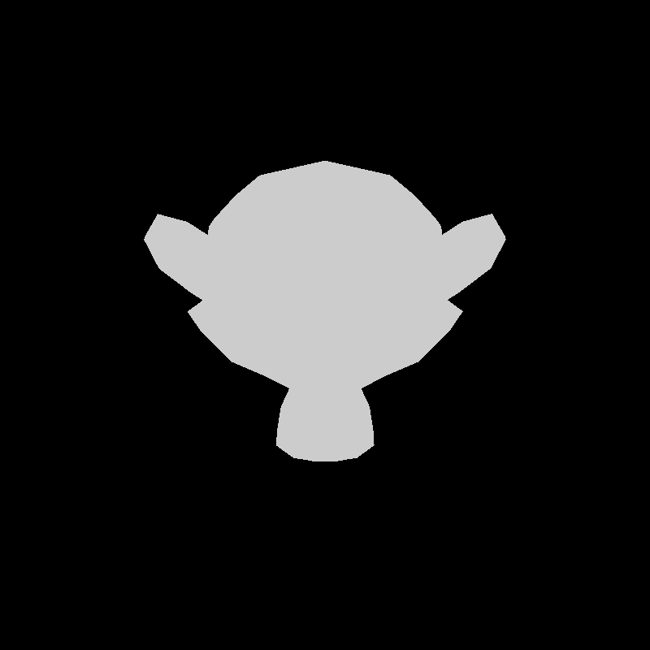
 
 
 ## Debug Level

 For this debug, the vector of nodes is traversed and all elements with the level specified have their respective AABB drawn. A few examples are shown below. The first two show how the difference in the split between level 3 and level 4, and the last image shows the stopping criterion, when splitting is no longer possible.\
 \
 \
 

 ## Debug leaves
 
 For this debug, the vector of nodes is traversed and all the leaf nodes are counted until the one that is asked. It then draws it's AABB and goes through all the triangles and draws them.

 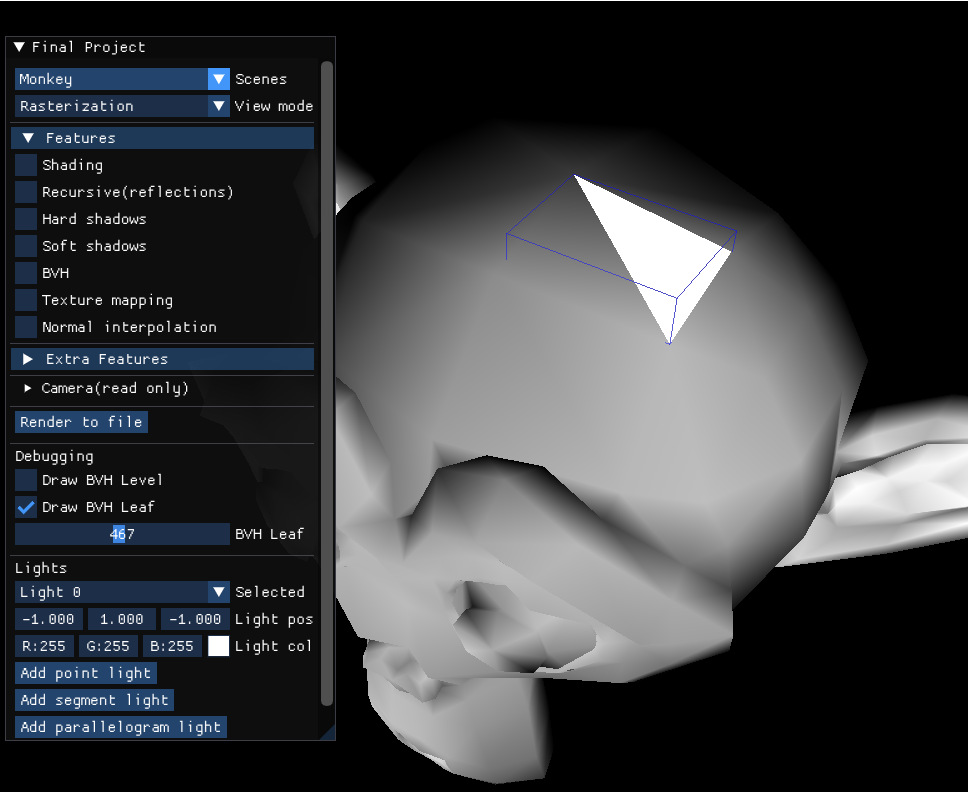
 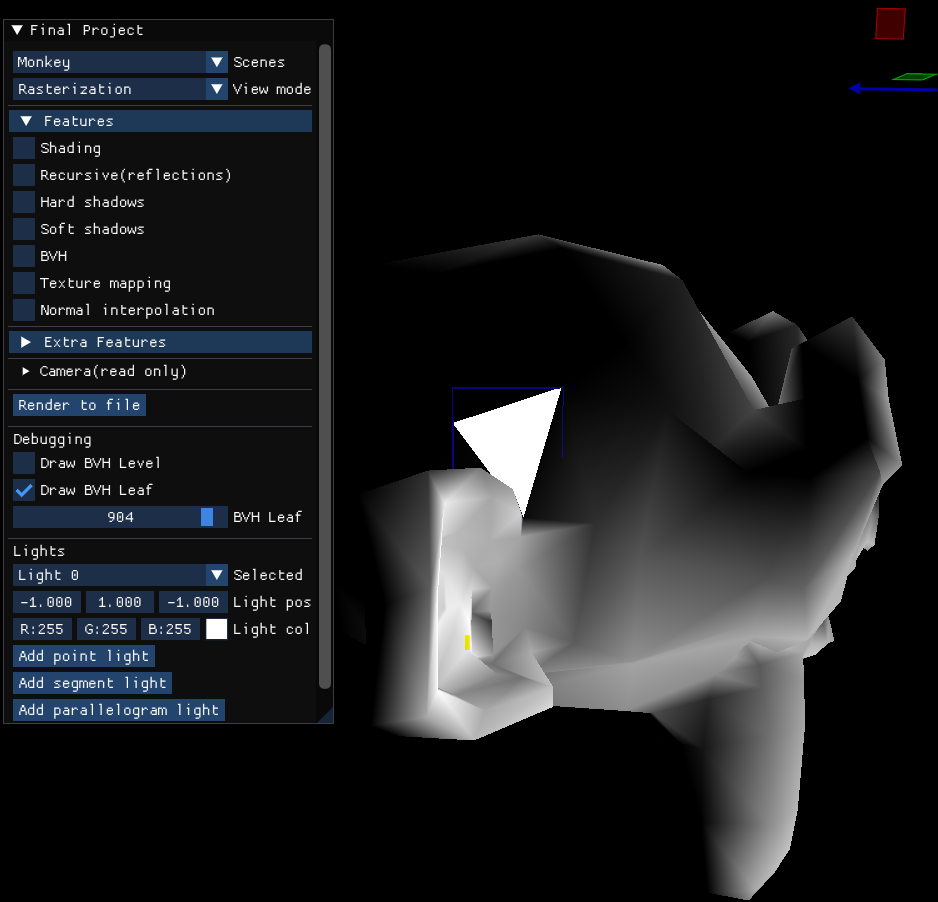
 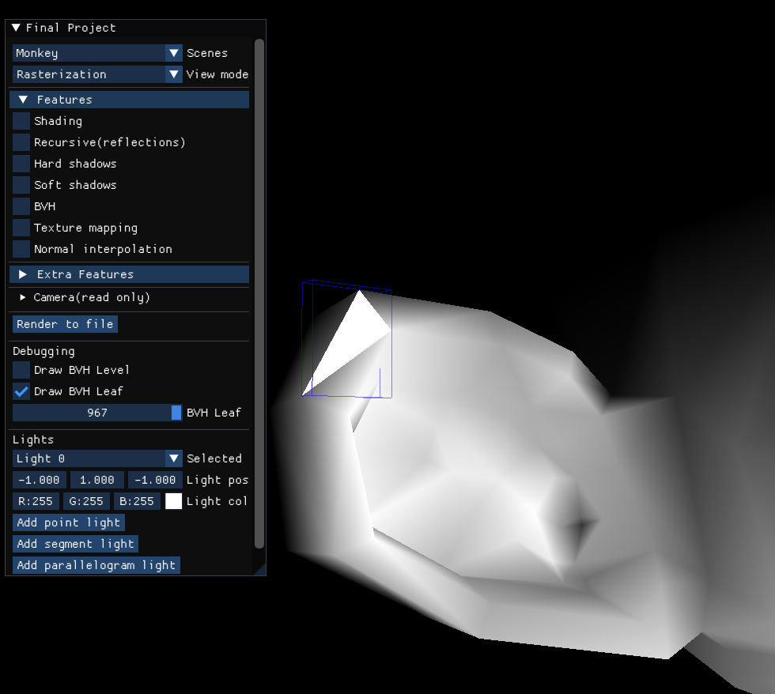


## *Defines* -  Creation Timer

In the `bounding_volume_hierarchy.cpp` file, after the imports, the following code is found:
```cpp
//Timer for creation of BVH
//#define creation_time
```
By uncommenting this `define` the time to create the BVH for the scene is printed.


# 3.5.2 Acceleration data-structure: Traversal

## *Defines*
The traversal has 3 main options from which one can choose. The options are created by using `#ifdef`. They can be switched in code by uncommenting the one that is preferred and commenting the rest. They are found in `bounding_volume_hierarchy.cpp` after the imports, alongside the other `#defines` used throughout this file. Example for using the basic traversal (which is going to be the one that is used, as explained below):
```c++
    // Traversal type
    #define basic_traversal
    //#define traversal_pq
    //#define traversal_vec

    //Timer for traversal for each individual ray
    //#define traversal_debug_time
```
* Note: `traversal_debug_time` can be activated in the same manner. It is used to time how much it takes for a single ray to be drawn.

There are multiple options so that we can choose which one is better suited for the specific use cases. Each option is explained below and there are measurements for how long the render for dragon took. The tests were done on the same laptop in similar circumstances.
## Basic traversal
The `basic_traversal` goes through each node, checking if the AABB is intersected, and if so, checks the children (or the triangles within, if it is a leaf node) until the closest hit is found. 

Time to render dragon: 2020.08 milliseconds

## *Priority Queue* traversal
The `traversal_pq` uses a priority queue that keeps the list always sorted by the distance from the origin of the ray to the node. The *priority_queue* is created using the implementation from `std`. In it, all the nodes that intersect the ray are placed and the closest one is taken for the next check. If it can not find anything closer inside of it, then it disregards it. However, if it does find something that is closer, that node will be placed in the queue and the algorithm will keep running. The *priority_queue* is traversed until it is empty. This is needed because, in case of colliding boxes, there might be a triangle that is the closest hit, but it is placed in the box that is further away (See image below). However, even in the case of no collisions, all the boxes have to be put in the *priority_queue*, because only the furthest box might actally contain a hit. Thus, traversing the whole *priority_queue* is necessary. The optimisation is supposed to come from the ordering and the choice of always picking the closest node. 

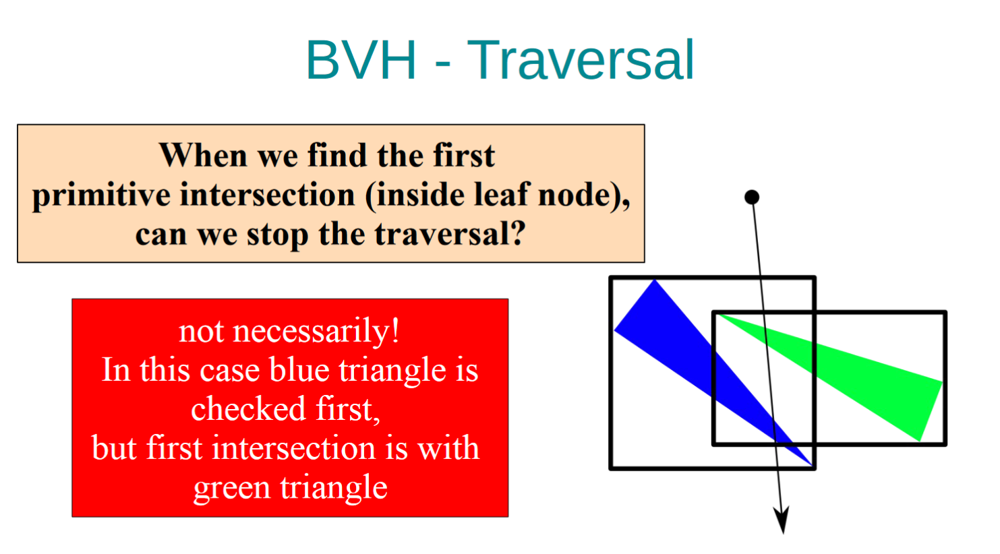

 *Image taken from: [Lecture slides - Accelerated Data structures - slide 137](https://brightspace.tudelft.nl/d2l/le/content/499418/viewContent/2765091/View)*  
 
Time to render dragon: 8216.78 milliseconds

## *Vector* traversal
The `traversal_vec` has the same implementation as for the *priority queue*, but instead uses a vector. For this, there were performed tests on 2 kinds of implementations. As it can be seen below, they perform similarly, but only the *sorted* version has been kept active in the code for the slightly better results. However, the code for *nth_element* can be found commented in the same method.

### *Sorted*
The vector is sorted after the new elements are added, so that the closest element will always be on the last position.

Time to render dragon: 6743.01 milliseconds

### *Nth element* to pick the closest
Before picking the element, we make use of `std::nth_element`, in order to take the maximum element and place it at the end of the vector for O(1) access and removal.

Time to render dragon: 7065.35 milliseconds

As can be seen from the empirical testing done above, the *priority queue* is much slower than the *basic traversal*, even though it should optimize the order of traversed nodes. Thus, the overhead from the creation and maintenance of this data structure is much larger than the possible benefit. The same can be said about the *vector*, performing better than the *priority queue*, but still worse than the naive traversal. Even though they perform slower in the tested case of the dragon, they might outperform the *basic traversal* when the tree is way larger than the 18 levels (counting from level 0) of the dragon and grows towards the maximum limit of 100. However, this is only a hypothesis and it has not yet been tested in any manner. However, because of the assignment, as a default we had to choose one of the 'optimized' implementations. And, because of the better performance, the *sorted* `traversal_vec` has been left as uncommented (i.e active) in the final submission.

## Render Images

These images are similar to the ones shown in *Section 3.5.1*, but they were much faster to produce. These are the times for rendering with and without BVH traversal:

* Monkey
    - With: Time to render image: 2403.82 milliseconds
    - Without: Time to render image: 7331.56 milliseconds
* Teapot
    - With: Time to render image: 2459.72 milliseconds
    - Without: Time to render image: 109022 milliseconds

 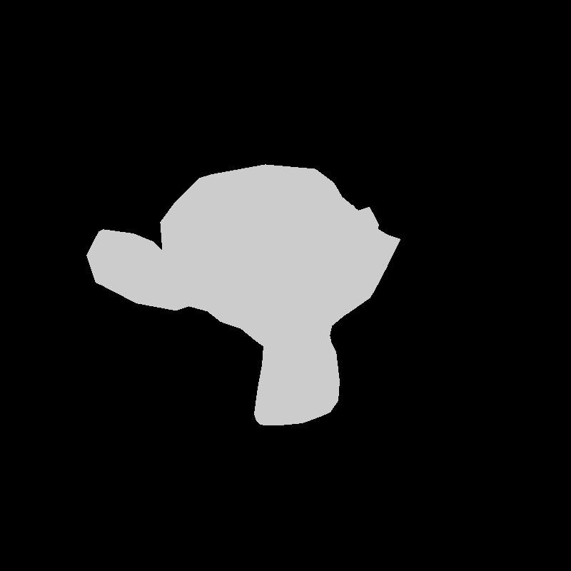
 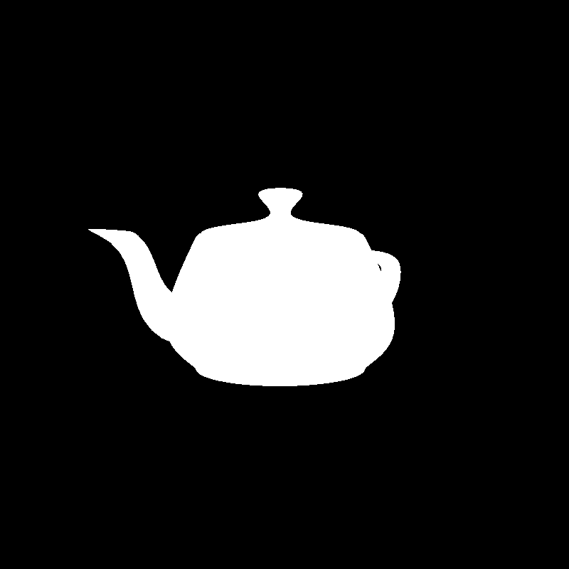

## Visual Debug

The active visual debug, that appears when the `BVH` flag is set, draws with green, for each ray shot, the *aabb* of the *nodes* that the ray intersects.

 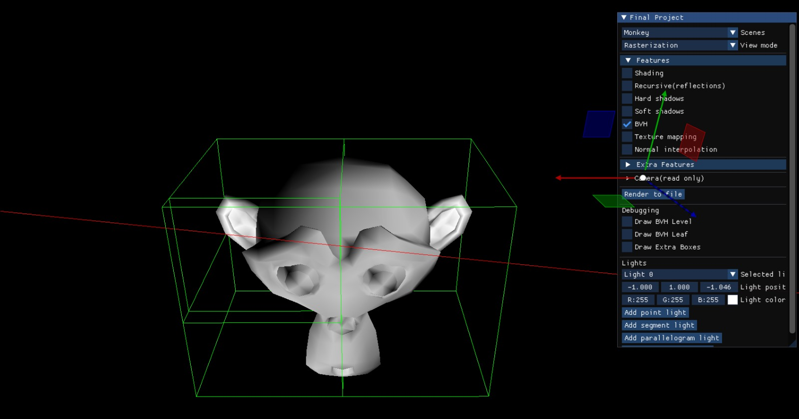
 


When the `Draw Extra Boxes` flag from the UI is set, the visual debug will now differentiate between checked boxes. The boxes colored green represent the boxes that are checked by the algorithm and intersect the ray, up until it hits a triangle. However, the red boxes represent the boxes that are checked by the algorithm but don't intersect the final ray.

 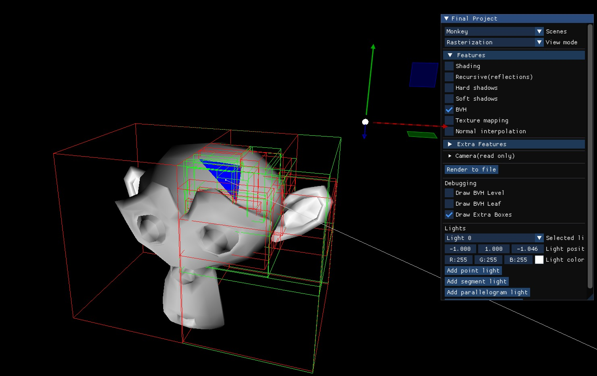

Note that when the ray does not hit anything, only the AABB of the whole scene is drawn as red.

 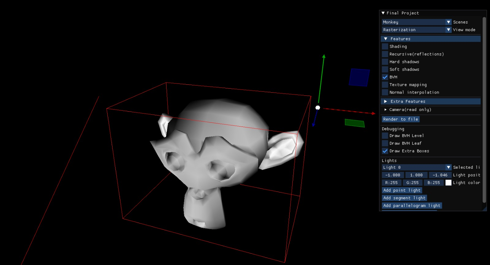


The images below represent the same functionality, with both `Extra Boxes` and without, but for the *Priority_Queue* traversal.

 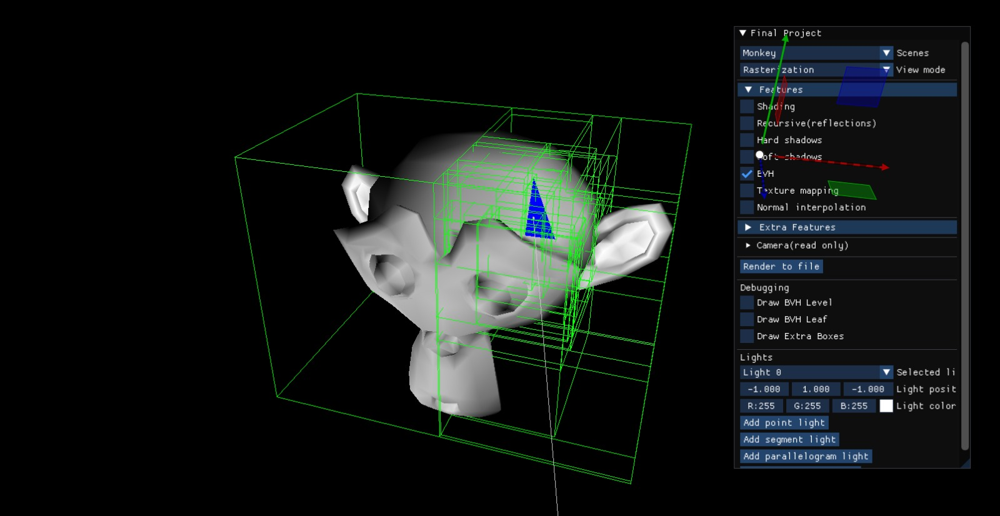
 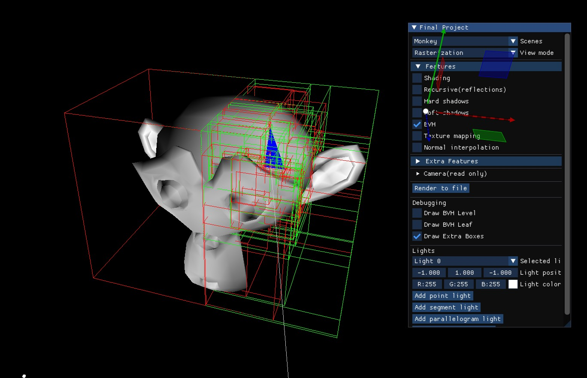

Lastly, the images below are generated from the *Vec* traversal.

 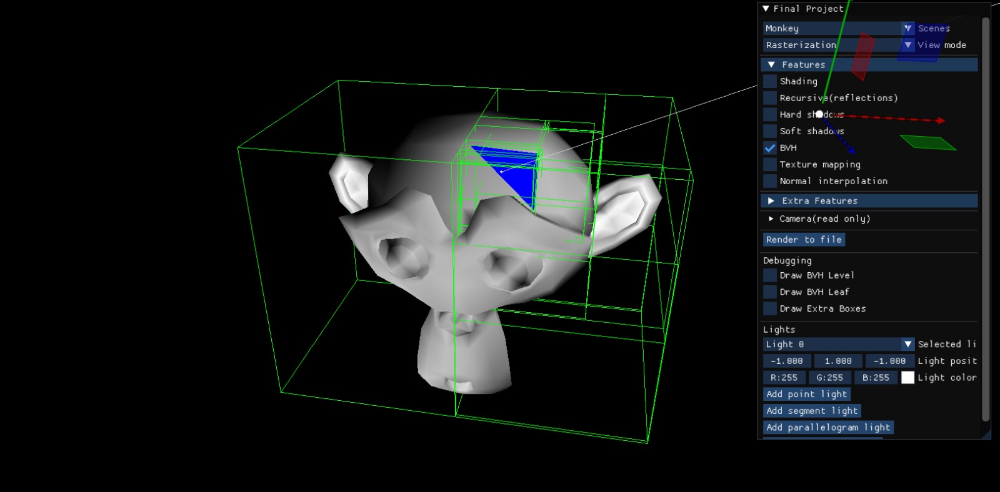
 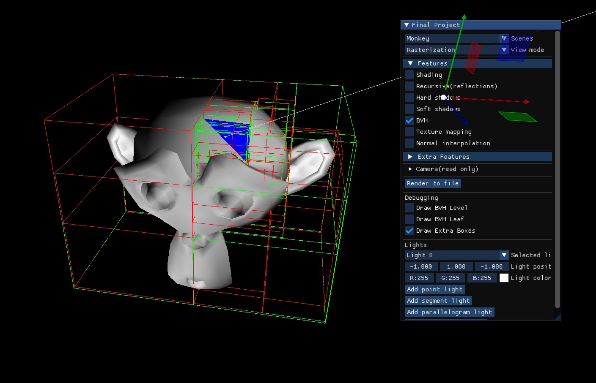


# 4.2 SAH+binning (Extra feature)

## *Defines*
The following code is taken from `bounding_volume_hierarchy.cpp`, and can be found after the rest of the `defines` described in the BVH section. 
* `numBins` represents the number of splits considered by the algorithm.
* `SAHdebug` means that the code will be able to run the visual debug for SAH.
```cpp
//Number of bins used for SAH
#define numBins 5
//Enable Visual Debug for SAH
#define SAHdebug
```

 * Note: another `#define numBins` exists in the `main.cpp` file, below de initializations of the variables used for `debugLevel` and `debugLeaves`. This should be the same in both files, and when a change is wanted, it has to be manually updated in both files.

## SAH split criterion

The difference from the normal BVH is the implementation of a new method (in `bounding_volume_hierarchy.cpp`):
```cpp
void splitBySAH(Scene* pscene,
    BoundingVolumeHierarchy::Node &parent,
    std::vector<int>& left,
    std::vector<int>& right)
```
This new method will be called when the SAH flag is enabled, instead of `splitByMedianTriangle()` (which is used by the previous BVH).

Firstly, the axis with the largest length of the AABB is found. This is done because the axis with the largest span has the most chances to benefit from the split. Then, all centroids are placed in a vector that contains the bin in which the centroid is located, and the pair of indices of mesh and triangle.

When splitting an interval into `numBins` bins (with bins from the interval $[0, numBins - 1]$ ), we need to know the following: `start` of interval and the `length` of the interval (which can also be computed by the *$end - start$* of interval). Then each point in that interval can be mapped into a bin with the following formula: *$(point - low) * numBins / length$*. This formula has been computed by trial and error, by taking multiple examples and trying to map them accordingly. The basic idea is to *translate* the interval to [0, length], by substracting `low` and then *dividing* by the length of a single bin *$length / numBins$* to get the number of bins between 0 and the point. Note that this is stored in an `int`, meaning that for the general case the `floor` of this formula should be used.

Afterwards, the vector is sorted by the bin numbers. Then, each split point is checked if it has the minimum cost, and if so the partition done at that point will be returned to the previous method, to further create the BVH. At each split point the vector is split into `lSplit` which has elements from bins $[0, split]$ and `rSplit` with the elements from bins $[split + 1, numBins - 1]$. Also, the split point at $numBins - 1$ is not taken into consideration, because `lSplit` will have all the elements and no split would be done. The cost for the split is computed by taking the cost of intersecting the primitives (e.g `lSplit.size()`) and multiplying with the probability to hit the new AABB (which is equal to *Volume_split / Volume_parent*) and added together for both left and right and added with the cost of traversal. However, the cost of traversal is constant, so it can be ignored. Also, because the *volume_parent* is present in all probabilities, it can also be disregarded. Thus, the formula used is: $`lSplit.size() * volume(AABB(lSplit)) + rSplit.size() * volume(AABB(rSplit))`$. To be noted that `cost_min` is initialised with the cost before a split, so if no splitting has a lower cost than splitting, there will be no further divisions done for that node. Also, if the split cost is equal, the split that has the difference bewtween `lSplit.size` and `rSplit.size` minimal is considered (i.e it tries to split the elements in half).
 
## Render Images

 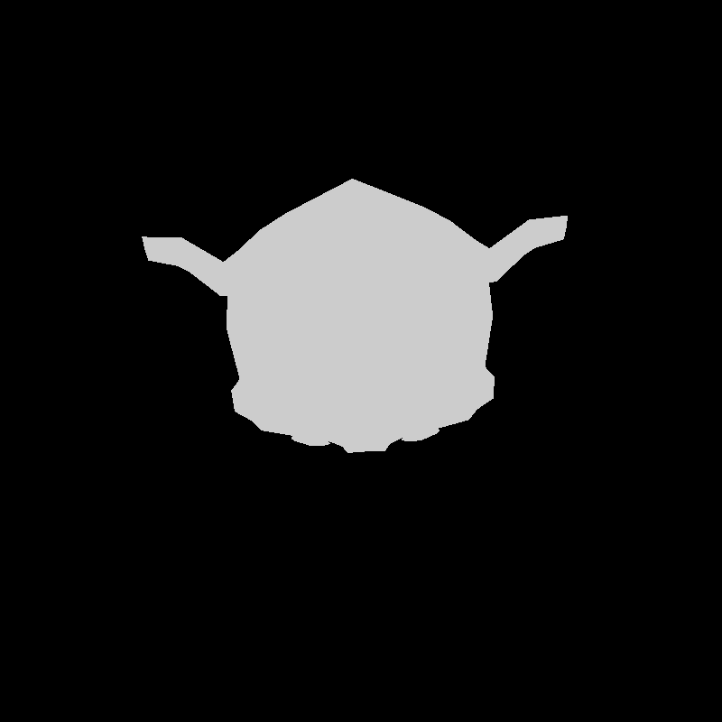
 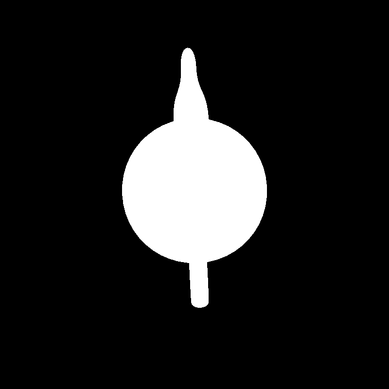

## Visual Debug

In order for the visual debug to work, the method `void debugSAH(int level, int split);` has been added to to the following files:
- `bounding_volume_hierarchy.cpp`
- `bounding_volume_hierarchy.h`
- `bvh_interface.cpp`
- `bvh_interface.h`

The last two files have been modified in order to allow the `debugSAH` method to be called for `bvh` inside of `main.cpp`, because the debug method needs acces to the tree of `Nodes` of bvh. 

Also, in the `Node` struct, the following code has been added:
```cpp
//These are only used for SAH debug puproses
int actual_split = -1;
std::vector<std::pair<int, std::pair<int, int>>> debug_splits;
```
These variables are only updated if `#define SAHdebug` is left uncommented as described above. They are used to store the split with the lowest cost and the vector with bins.

When the SAH flag from extra features is enabled, the UI is updated with a new section called `SAH Debug`, that contains a button `Draw splits`, that will show 2 sliders one for the level of the nodes and one for the split number. The UI is updated from the `main.cpp` file.

The visual debug draws the nodes on the level specified (with a white wireframe) and then draws the boxes that correspond to the chosen split. If the split is the one chosen by the algorithm, the boxes will be drawn green, otherwise they will be red. Note that when no splitting can be done, the red/green boxes will not be drawn. Also, if the `#define SAHdebug` is commented, this debug will behave in a similar way as `debugDrawLevel()`.

The following images show the difference between two splits done at level 0 (level 0 was chosen for visibility purposes)

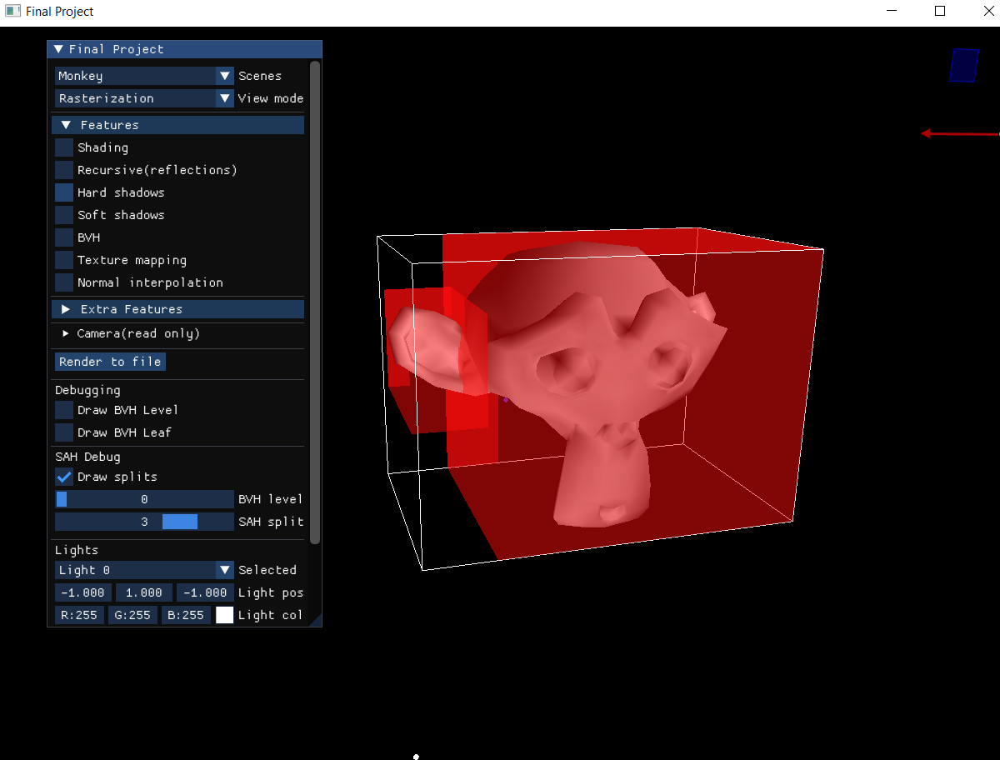
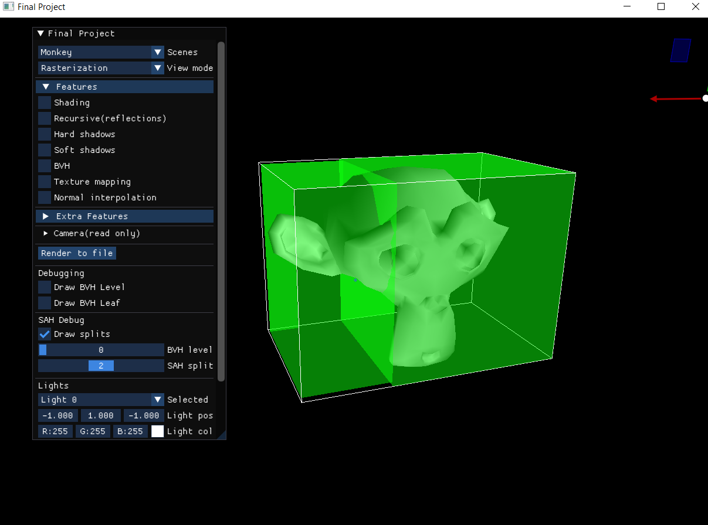

Another interesting outcome is that different splits are green for some nodes, but red for others. For this example, level 2 from monkey has been represented by splits 0,1,2,3.

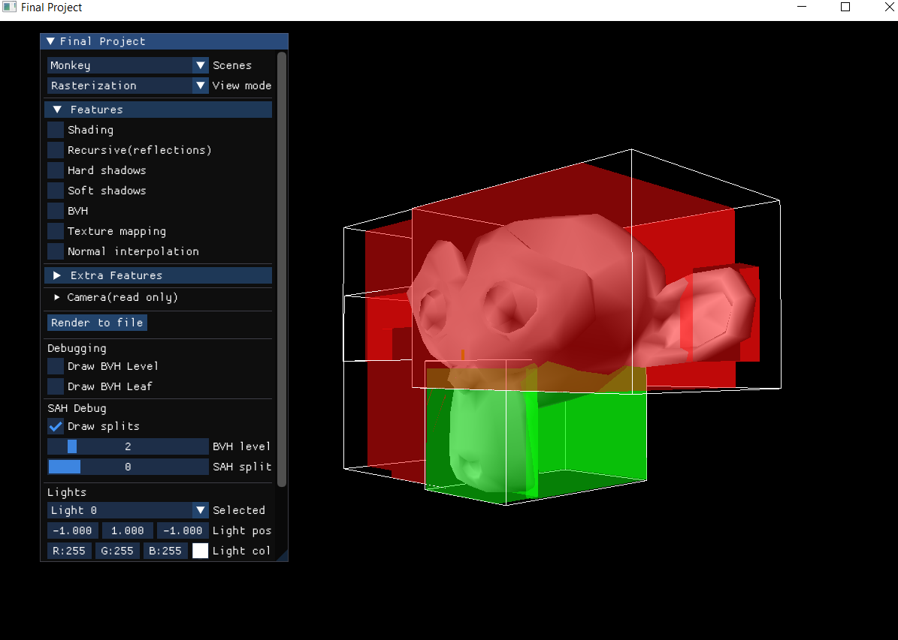
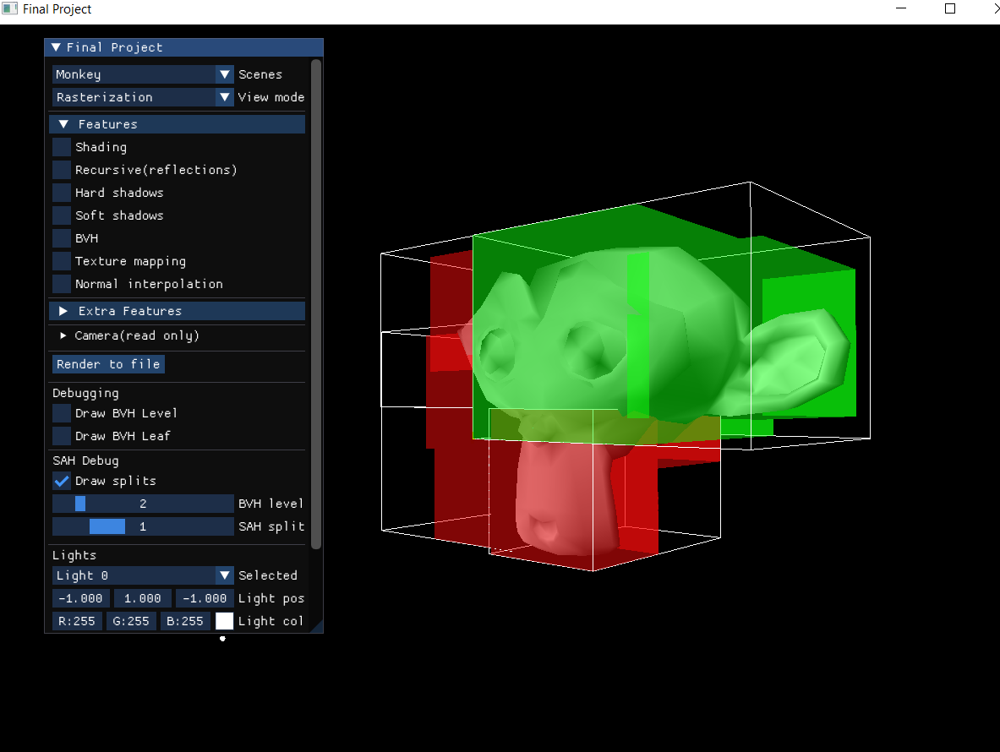
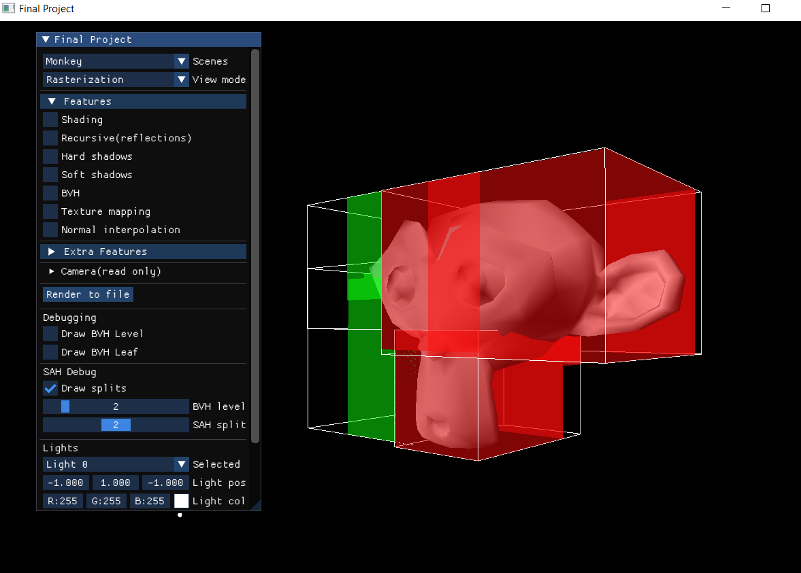
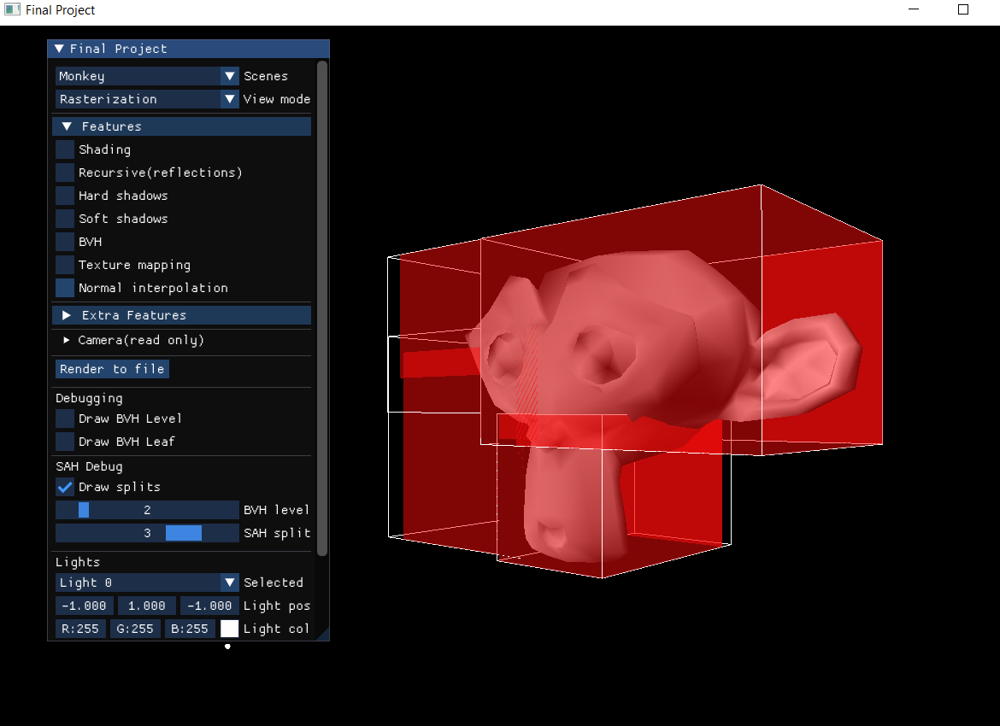


## Other Notes

When the SAH flag is enabled, for the bvh to actually use the new split criterion, the scene needs to be reloaded manually.


# 4.10 Deapth Of Field (Extra feature)

## *Defines* and initialisations
There are 2 places where new `#defines` have been declared for this feature. The first one is located in `render.cpp` and can be found above the methods for `renderRayTracing()`, `executeDepthOfField()` and `randomOffset()`: `#define numSamples 20`. This represents the number of secundary rays generated by by the `executeDepthOfField()` method, for each ray given. The higher the `numSamples` the better the result will be. However, it is set to a relatively low number to limit performance issues during testing. The second place is in `main.cpp` file, at the very beginning of the `main()` method:
```cpp
    // Deapth of Field variables
    #define MAX_FOCAL_LENGTH 30.0f
    #define MIN_FOCAL_LENGTH 0.1f
    #define MAX_APERTURE 1.0f
    #define MIN_APERTURE 0.1f

    bool dof = { false };

    //This enables the visual debug for deapth of field
    #define DOFdebug
```
The `#defines` and variables are used for the sliders in the UI, so that the user can change the `focal_length` and the `aperture` bewteen the `MIN_APERTURE`, `MAX_APERTURE`, and `MIN_FOCAL_LENGTH`, `MAX_FOCAL_LENGTH`, respectively. These 2 variables can be found in the `Features` struct from `common.h`, inside the `DOF` sturct. They have been placed here for easier access for the method that computes the depth of field, that is located inside `render.cpp`. 

The `#define DOFdebug` enables the visual debug when this line of code is uncommented, and disables it when it is commented.

## Calculating the Depth Of Field

The acutal implementation of depth of field can be located in `executeDepthOfField()`, which is in `render.cpp` file, above the `renderRayTracing()` method. Firstly, it calculates the `focal_point` that lies on the ray that it receives at distance `focal_length`. Then, it generates `numSamples` secondary rays that have the same origin as the primary ray, but shifted by a *random offset* in all direction. The direction for the secondary rays is given by their origins and the `focal_point`. The final color is given by averaging the colors from all these rays.

## Random Offset

The random offset gives a random float number between $-aperture$ and $+aperture$. This is done by generating a random float number using the C++ `rand()` function and dividing it by `RAND_MAX`, so that this value is between 0 and 1. Then, it is multiplied by $2 * aperture$, so that the value is between 0 and $2 * aperture$. Finally, the values are shifted by subtracting $-aperture$, so that the values now lie in the desired interval. 

## Render Images

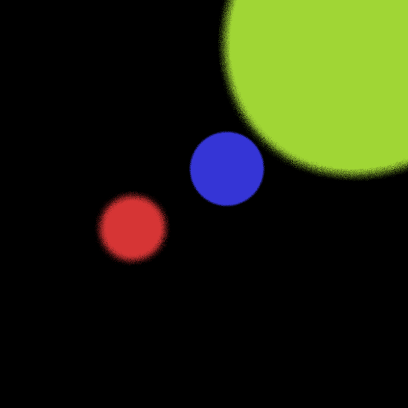


Both images are taken with a similar aperture, but different `focal_length`. For the first picture, the `focal_length` was chosen in such a way that the blue (middle - second closest) sphere was in focused, while the second picture depicts the lime (right - closest) sphere in focus and the others out of focus.

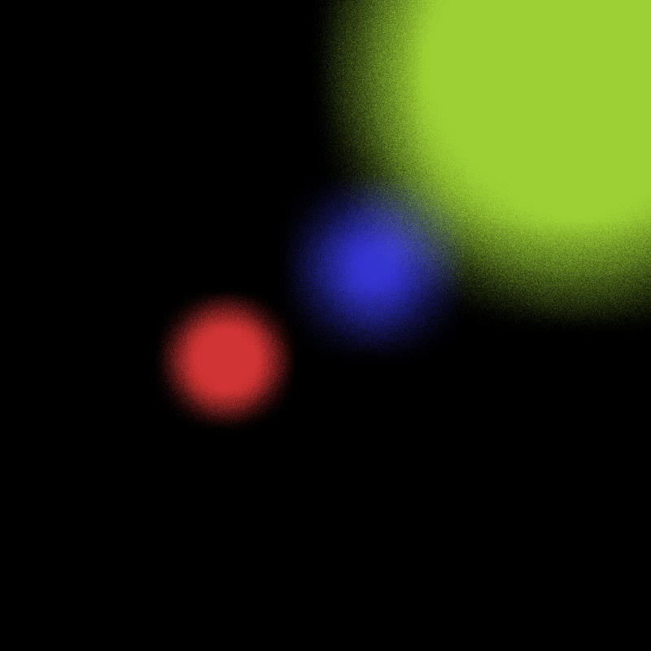

This last image, was taken with an increased number of samples and `focal_length` set to the maximum predefined value, in order to exagerate the effects of depth of field for all objects.

## Visual Debug

As mentioned above, for the visual debug to work, the `#define DOFdebug` has to be left uncommented. The visual debug draws the wireframe of the sphere (a new method has been implented in `draw.cpp` for this purpose called `drawSphereWireFrame()`). This sphere is centered around the camera and has the radius `focal_length`, meaning that all objects that are intersected by this sphere have the part that is intersected in focus.

For example the image below will correspond to the first image that has been shown above, where the middle sphere is in focus and the rest are not.

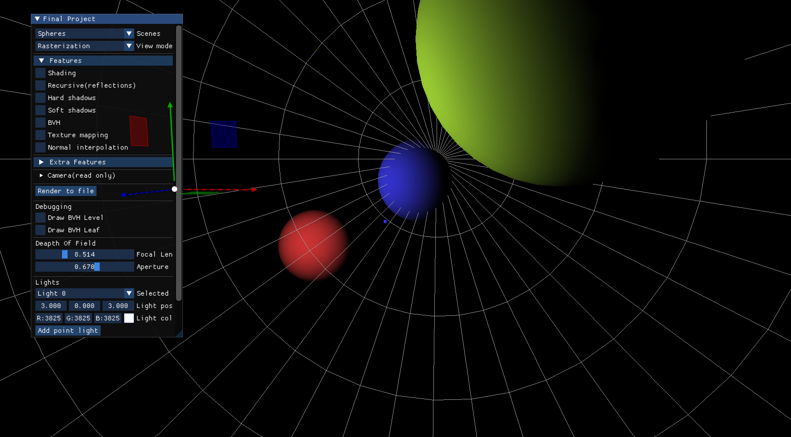

When the `focal_length` is not big enough for the *focal sphere* to reach any object, than all the wireframes of the sphere will appear in front of the objects, meanwhile, if it's too big, all object will be in front of the wireframe.

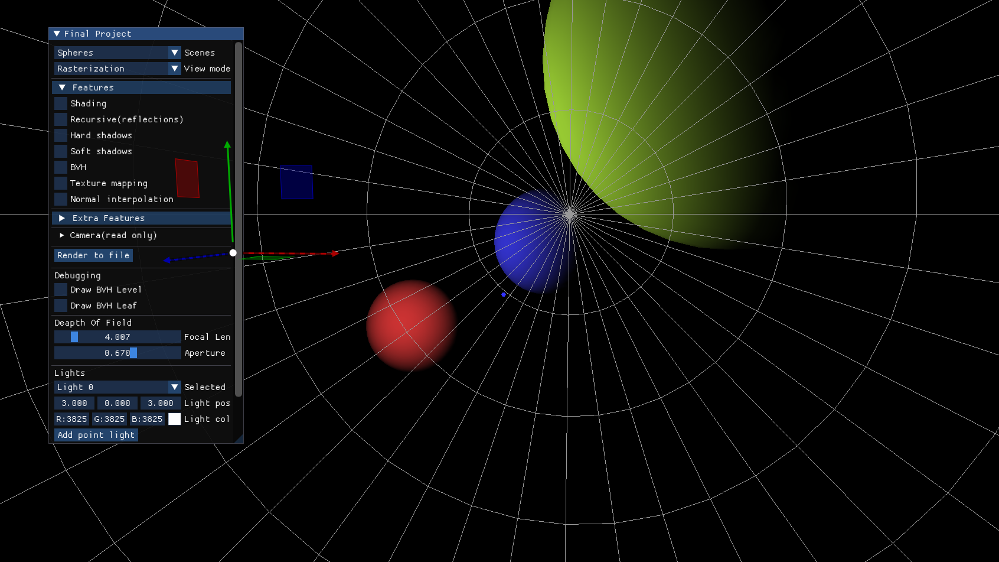


# 4.10 Deapth Of Field (Extra feature)

## *Defines* and initialisations
There are 2 places where new `#defines` have been declared for this feature. The first one is located in `render.cpp` and can be found above the methods for `renderRayTracing()`, `executeDepthOfField()` and `randomOffset()`: `#define numSamples 20`. This represents the number of secundary rays generated by by the `executeDepthOfField()` method, for each ray given. The second place is in `main.cpp` file, at the very beginning of the `main()` method:
```cpp
    // Deapth of Field variables
    #define MAX_FOCAL_LENGTH 30.0f
    #define MIN_FOCAL_LENGTH 0.1f
    #define MAX_APERTURE 1.0f
    #define MIN_APERTURE 0.1f

    bool dof = { false };

    //This enables the visual debug for deapth of field
    #define DOFdebug
```
The `#defines` and variables are used for the sliders in the UI, so that the user can change the focal length and the aperture bewteen the `MIN_APERTURE`, `MAX_APERTURE`, and `MIN_FOCAL_LENGTH`, `MAX_FOCAL_LENGTH`, respectively. The `#define DOFdebug` enables the visual debug when this line of code is uncommented, and disables it when it is commented.

## Calculating the Depth Of Field

The acutal implementation of depth of field can be located in `executeDepthOfField()`, which is in `render.cpp` file, above the `renderRayTracing()` method. Firstly, it calculates the `focal_point` that lies on the ray that it receives at distance `focal_length`. Then, it generates `numSamples` secondary rays that have the same origin as the primary ray, but shifted by a *random offset* in all direction. The direction for the secondary rays is given by their origins and the `focal_point`. The final color is given by averaging the colors from all these rays.

## Random Offset

The random offset gives a random float number between $-aperture$ and $+aperture$. This is done by generating a random float number using the C++ `rand()` function and dividing it by `RAND_MAX`, so that this value is between 0 and 1. Then, it is multiplied by $2 * aperture$, so that the value is between 0 and $2 * aperture$. Finally, the values are shifted by subtracting $-aperture$, so that the values now lie in the desired interval. 

## Render Images


Both images are taken with a similar aperture, but different `focal_length`. For the first picture, the `focal_length` was chosen in such a way that the blue (middle - second closest) sphere was in focused, while the second picture depicts the lime (right - closest) sphere in focus and the others out of focus.


This last image, was taken with an increased number of samples and `focal_length` set to the maximum predefined value, in order to exagerate the effects of depth of field for all objects.

## Visual Debug

As mentioned above, for the visual debug to work, the `#define DOFdebug` has to be left uncommented. The visual debug draws the wireframe of the sphere (a new method has been implented in `draw.cpp` for this purpose called `drawSphereWireFrame()`). This sphere is centered around the camera and has the radius `focal_length`, meaning that all objects that are intersected by this sphere have the part that is intersected in focus. Also, the sphere moves along with the camera. This visual debug is only active in *Rasterization*, so that the effects that would happen in *Ray Traced* can be *previewed*, without performance issues.

For example the image below will correspond to the first image that has been shown above, where the middle sphere is in focus and the rest are not.


When the `focal_length` is not big enough for the *focal sphere* to reach any object, than all the wireframes of the sphere will appear in front of the objects, meanwhile, if it's too big, all object will be in front of the wireframe.


# 6.4 Performance Test

The following table has been filled with the times for creating and rendering with different scenes and algorithms.

|                                      | Cornell Box |   Monkey   |   Dragon   |
| :----------------------------------- | :---------: | :--------: | :--------: |
| Num Triangles                        |     32      |    968     |    87K     |
| Time to create                       |  0.1073 ms  |  1.581 ms  | 166.793 ms |
| Time to create with SAH              |  0.0991 ms  | 2.6324 ms  | 345.769 ms |
| Time to render for basic             | 1064.87 ms  | 1665.16 ms | 2020.08 ms |
| Time to render for PQ                | 1985.43 ms  | 2949.06 ms | 8216.78 ms |
| Time to render for Vec (Nth element) | 2923.67 ms  | 4290.63 ms | 7065.35 ms |
| Time to render for Vec  (Sort)       | 2717.67 ms  | 3403.93 ms | 6743.01 ms |
| Time to render with SAH  for basic   | 1034.82 ms  | 1210.08 ms | 1580.00 ms |
| BVH levels                           |      6      |     11     |     17     |
| BVH with SAH levels                  |      9      |     17     |     24     |
| Max tris p/ leaf node                |      1      |     1      |     1      |
| Max tris p/ leaf node (SAH)          |     10      |     21     |     17     |

Note: For rendering with SAH the `#define SAHdebug` is commented. 