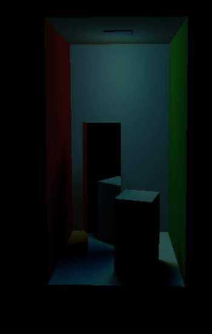

# 3.3 Hard Shadows
For the hard shadows feature, two methods were modified. The method `testVisibilityLightSample` and `computeLightContribution` in `light.cpp` were modified to implement the hard shadows feature.

## testVisibilityLightSample method
`testVisibilityLightSample` is a method that checks if a given light sample is visible from an intersection point. In this method, I first used ray to compute the intersection point. This was done by `point = ray.origin + ray.t * ray.direction`, as this gives a position of the intersection point. Then, a direction vector from this point to the light source, called `vec`, was computed by doing `samplePos - point`, in which `samplePos` is the position of the light source. Then, the length of this vector was saved in a variable called `length`, and `vec` was normalized. 

The attributes of the ray were modified, in order to make a shadow ray, from the point as an origin to the light source. This was done by modifying the ray’s direction as `vec`, and setting `ray.t` as length of the direction vector. In addition to it, the origin of the ray was modified to `point + 0.0001f * vec`. An offset of 0.0001f was added due to some noises.

Lastly, the `intersect` method from `bvh` was called with the following input parameters: `ray`, `hitInfo`, `features`. This was to check if anything is between the origin of the ray and the light source. If there is anything intersecting, it modifies the ray’s t to the intersecting object. As a visual debug, this ray of color red is drawn and 0.0f, representing that the point is not visible from the light source. If it does not intersect, it means that there is nothing in between the point and the light source, hence 1.0f is returned.

## computeLightContribution method
Not only the `testVisibilityLightSample` method was modified, but also the `computeLightContribution` method in `light.cpp` was modified. In this method, there are two cases for the hard shadow, which is when both shading and hard shadows feature flags are enabled, and when only the hard shadows feature flag is enabled. When both shading and hard shadow flags are enabled, the hard shadows must be drawn, so for each `pointLight`, `testVisibilityLightSample` and `computeShading`method are both called for this purpose. When only the hard shadows flag is enabled, the user should be able to debug it. Therefore, only `testVisibilityLightSample` is called without `computeShading` in order to draw the shadow rays. 

Below are the rendered images and visual debug.

## Rendered images

## Visual debug images

First visual debug image shows that when there is no object between the point and the light source, a shadow ray of color of the light source is drawn. Second image shows that if there is any object in between, then a ray in the color of red is drawn from the point to the object, not the color of the light source.

# 3.4 Area lights
For the area lights feature, three methods in `light.cpp` were modified, which are: `sampleSegmentLight`, `sampleParallelogramLight` and `computeLightContribution`. In `main.cpp` a slider was created in order for the user to decide on how many light samples to use. In order to do this, a variable called `numberOfSamples` was created in `common.h`.

## light.cpp

In `light.cpp`, three methods were modified, which are: `sampleSegmentLight`, `sampleParallelogramLight` and `computeLightContribution`. For both segment light and parallelogram light, a random sampling was used. This is because generating regular samples can lead to visual artifacts in the form of patterns. In order to prevent samples being one-sided, for example in a segment, the user can decide how many samples to generate using a slider, up to 500 samples.

## sampleSegmentLight method

In the `sampleSegmentLight` method, a random float variable between 0 and 1 is created. Then, by using a linear interpolation, a position and the color at this position is calculated using color at both endpoints.

## sampleParallelogramLight method

In the `sampleParallelogramLight` method, two random floats between 0 and 1, called `a` and `b`, are created. Then, two vectors called `col1` and `col2` are created, which represent the `edge01` and `edge02` vector, multiplied by `a` and `b` respectively. Using these `a`and `b` vectors, a position of the random sample can be calculated, by `parallelogramLight.v0 + a + b`. By calculating the cross product of `edge01` and `edge02` vectors, and computing the length of this cross product gives the total area, which is saved to a variable called `total`. Then, four distances are calculated using a cross product. These four distances were used to calculate the color at the position by a bilinear interpolation.

## computeLightContribution method

In the `computeLightContribution` method, when both shading and soft shadow flags are enabled, soft shadows can be computed. When there is a segment light, a for-loop is iterated by the number of light samples to generate. In each iteration for both segment light and parallelogram light, `sampleSegmentLight` and `sampleParallelogramLight` are called by this number of times. For each light sample, if it is `testVisibilityLightSample` returns 1.0f, then this color is added to `printColor`. After the iteration, this `printColor` is divided by the number of samples to average the shading result from all rays that hit the light source.

When only the soft shadow flag is enabled, the same process is repeated. However, a shading is not drawn and only the ray from the point to each light point is drawn for debugging purposes.

## common.h and main.cpp

In order for the user to decide how many light samples to generate, a variable called `numberOfSamples` in `common.h`. Then, a sliderInt is created in `main.cpp` for the user to decide how many samples to generate, from 1 sample to a maximum of 500 samples. 

Below are the rendered images and images for visual debug.

## Rendered images

First rendered image is rendered soft shadow images with parallelogram light and second image is rendered image with segment light with different color at each endpoint.

## Visual debug images

