# Report - Computer Graphics Final Project
# Group members

* Alex Preda - 5567262
* Hongwoo Cho - 5028647
* Razvan Nistor - 5461499
 
# 3. Standard features
# 3.1 Shading
The shading part is implemented over 4 functions: 

```computeShading(...)``` in shading.cpp  
```computeLightContribution(...)``` in light.cpp  
```getFinalColor(...)``` in render.cpp  
`intersect` in boundingVolumeHierarcy.cpp

## computeShading
This function applies the Phong model to the point of intersection between the ray and surface by adding the diffuse and specular components together:

$Diffuse = I \cdot K_d \cdot \cos(\theta)$  
$Specular = I \cdot K_s \cdot (\cos\phi)^n$ 
 
Where:  
- $\theta$ is the angle formed by light direction and the surface normal  
- $\phi$ is the angle between direction to the camera and the reflection of the light direction over the surface normal  
- n is the shininess of the surface

The $\cos$ is calculated using the dot product over normalized vectors. It is also used to check whether the light is coming from behind the surface.

## computeLightContribution


If shading is enabled, the function will calculate the influence of each light source over the point on the surface by invoking ```computeShading``` for each light and adding the results. Moreover, by using ```testVisibilityLightSample```,  it checks if a light source actually has influence over that point (is visible from that point or it is in shadow).  Otherwise it will return the albedo of the material.

## getFinalColor 

This function calls ```computeLightContribution``` for each ray that intersects a surface.

## intersect

Here we compute the normal for each intersected surface. This is done by doing the cross product of 2 intersecting sides of the intersected triangle. Afterwards, this vector is, of course, normalised.

## Additional info

For the visual debug, a ray of the computed color will be drawn(see pictures).
Sources used: Lecture 04 - Shading. (n.d.). Brightspace. https://brightspace.tudelft.nl/d2l/le/content/499418/viewContent/2765037/View


### Shading, ray trace mode, Cornell Box (with mirror)


### Shading, 257 light samples, ray-trace mode, Cornell Box (parallelogram and mirror)


### Shading, rasterization mode, Cornell Box (with mirror)


### Shading, rasterization mode, Cornell Box (with mirror)

# 3.2 Recusive ray-tracer

The recursive ray-tracer is split over 3 functions:  
```getFinalColor(...)``` in render.cpp  
```computeReflectionRay(...)``` in shading.cpp  
`intersect` in boundingVolumeHierarcy.cpp

## getFinalColor

If the recursive ray-tracer is enabled, the function will recursively calculate the reflection of a ray(while the materials hit are reflective, meaning $K_s \ne 0$  and `rayDepth` $\ne 0$ ) using `computeReflectionRay`. For each ray, it will compute the color(accounting for the effect of all the reflected rays by multiplying the color computed for the reflected ray with $K_s$), draw it, and return the computed color to be used for the color computation of the previous rays. The color is computed using `computeLightContribution`.   

## computeReflectionRay

In this function the reflected ray is computed by calculating each of the 3 components:  
- t - it is set to infinity(or max float) because the ray didn't intersect any surface yet(this will happen in get final color using the `bvh.intersect`)  
- direction - it is computed by reflecting the incoming ray over the normal using the following formula: $r = d - 2(d\cdot n)n$, where $r$ is the reflected ray direction, $d$ is the incoming ray direction and $n$ is the surface normal.
- origin - it is the point of intersection of the incoming ray with the surface displaced by an epsilon(really small value) in the direction of the reflection. The displacement is done to prevent auto-intersection(reflected ray intersects with the incoming ray resulting in the reflected ray's t to be equal to 0).

## intersect

!Same as shading(This is used for both features)
Here we compute the normal for each intersected surface. This is done by getting the direction of the perpendicular line to the surface by doing the cross product of 2 intersecting sides of the intersected triangle. This is, of course, normalised.

## Additional info

A ray starts with a certain, ```rayDepth```, assigned in render.h and every time it is reflected, the ```rayDepth``` is decreased. When it reaches 0, it will no longer be reflected. In the submited solution, the default `rayDepth` is 5.  

Visual debug shows a ray and its reflection and in ray-trace mode a working mirror(see pictures)


### Recursive ray-tracing, rasterization mode, Cornell Box (with mirror)


### Recursive ray-tracing, rasterization mode, Cornell Box (with mirror)


### Recursive ray-tracing, rasterization mode, Cornell Box (with mirror)


### Recursive ray-tracing, shading, ray-trace mode, Cornell Box (with mirror)


### Recursive ray-tracing, shading, ray-trace mode, Cornell Box (with mirror)

# 3.3 Hard Shadows

For the hard shadows feature, two methods were modified. The method `testVisibilityLightSample` and `computeLightContribution` in `light.cpp` were modified to implement the hard shadows feature.

## testVisibilityLightSample method

`testVisibilityLightSample` is a method that checks if a given light sample is visible from an intersection point. In this method, I first used ray to compute the intersection point. This was done by `point = ray.origin + ray.t * ray.direction`, as this gives a position of the intersection point. Then, a direction vector from this point to the light source, called `vec`, was computed by doing `samplePos - point`, in which `samplePos` is the position of the light source. Then, the length of this vector was saved in a variable called `length`, and `vec` was normalized. 

The attributes of the ray were modified, in order to make a shadow ray, from the point as an origin to the light source. This was done by modifying the ray’s direction as `vec`, and setting `ray.t` as length of the direction vector. In addition to it, the origin of the ray was modified to `point + 0.0001f * vec`. An offset of 0.0001f was added due to some noises.

Lastly, the `intersect` method from `bvh` was called with the following input parameters: `ray`, `hitInfo`, `features`. This was to check if anything is between the origin of the ray and the light source. If there is anything intersecting, it modifies the ray’s t to the intersecting object. As a visual debug, this ray of color red is drawn and 0.0f, representing that the point is not visible from the light source. If it does not intersect, it means that there is nothing in between the point and the light source, hence 1.0f is returned.

## computeLightContribution method

Not only the `testVisibilityLightSample` method was modified, but also the `computeLightContribution` method in `light.cpp` was modified. In this method, there are two cases for the hard shadow, which is when both shading and hard shadows feature flags are enabled, and when only the hard shadows feature flag is enabled. When both shading and hard shadow flags are enabled, the hard shadows must be drawn, so for each `pointLight`, `testVisibilityLightSample` and `computeShading`method are both called for this purpose. When only the hard shadows flag is enabled, the user should be able to debug it. Therefore, only `testVisibilityLightSample` is called without `computeShading` in order to draw the shadow rays. 

Below are the rendered images and visual debug.

## Rendered images

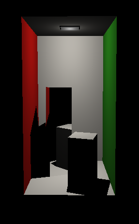


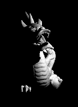

## Visual debug images

First visual debug image shows that when there is no object between the point and the light source, a shadow ray of color of the light source is drawn. Second image shows that if there is any object in between, then a ray in the color of red is drawn from the point to the object, not the color of the light source.


# 3.4 Area lights

For the area lights feature, three methods in `light.cpp` were modified, which are: `sampleSegmentLight`, `sampleParallelogramLight` and `computeLightContribution`. In `main.cpp` a slider was created in order for the user to decide on how many light samples to use. In order to do this, a variable called `numberOfSamples` was created in `common.h`.

## light.cpp

In `light.cpp`, three methods were modified, which are: `sampleSegmentLight`, `sampleParallelogramLight` and `computeLightContribution`. For both segment light and parallelogram light, a random sampling was used. This is because generating regular samples can lead to visual artifacts in the form of patterns. In order to prevent samples being one-sided, for example in a segment, the user can decide how many samples to generate using a slider, up to 500 samples.

## sampleSegmentLight method

In the `sampleSegmentLight` method, a random float variable between 0 and 1 is created. Then, by using a linear interpolation, a position and the color at this position is calculated using color at both endpoints.

## sampleParallelogramLight method

In the `sampleParallelogramLight` method, two random floats between 0 and 1, called `a` and `b`, are created. Then, two vectors called `col1` and `col2` are created, which represent the `edge01` and `edge02` vector, multiplied by `a` and `b` respectively. Using these `a`and `b` vectors, a position of the random sample can be calculated, by `parallelogramLight.v0 + a + b`. By calculating the cross product of `edge01` and `edge02` vectors, and computing the length of this cross product gives the total area, which is saved to a variable called `total`. Then, four distances are calculated using a cross product. These four distances were used to calculate the color at the position by a bilinear interpolation.

## computeLightContribution method

In the `computeLightContribution` method, when both shading and soft shadow flags are enabled, soft shadows can be computed. When there is a segment light, a for-loop is iterated by the number of light samples to generate. In each iteration for both segment light and parallelogram light, `sampleSegmentLight` and `sampleParallelogramLight` are called by this number of times. For each light sample, if it is `testVisibilityLightSample` returns 1.0f, then this color is added to `printColor`. After the iteration, this `printColor` is divided by the number of samples to average the shading result from all rays that hit the light source.

When only the soft shadow flag is enabled, the same process is repeated. However, a shading is not drawn and only the ray from the point to each light point is drawn for debugging purposes.

## common.h and main.cpp

In order for the user to decide how many light samples to generate, a variable called `numberOfSamples` in `common.h`. Then, a sliderInt is created in `main.cpp` for the user to decide how many samples to generate, from 1 sample to a maximum of 500 samples. 

Below are the rendered images and images for visual debug.

## Rendered images

First rendered image is rendered soft shadow images with parallelogram light and second image is rendered image with segment light with different color at each endpoint.


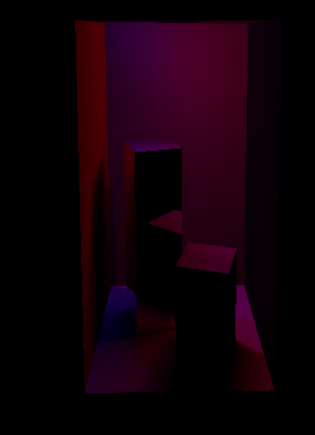

## Visual debug images


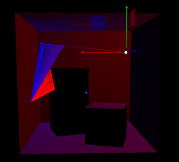

# 3.5.1 Acceleration data-structure: Creation

## Structure of BVH

 This data structure is represented in the `bounding_volume_hierarchy.h` file by a vector of *Nodes*. This new struct, located in the same file, is described by a boolean type (0 represents an internal node and 1 a leaf node), the level of the node in the tree structure, their respective AABB and a vector of integers. This vector either has 2 indices representing the indices of the left and right children nodes, or the list of all triangle indices (and their meshes) if the node is a leaf. When the latter is true, to differentiate between a triangle index and a mesh index, the meshes are represented by negative numbers. However, an extra step is necessary because both triangles and meshes start counting from 0. So, the meshes are shifted by one position (e.g -1 represents mesh 0, and 1 represents triangle 1). In addition, all triangles found after a mesh index are considered to be from that mesh (e.g the vector -1 0 1 -2 0, is considered as triangles 0, 1 from mesh 0 and triangle 0 from mesh 1).

## Construction

Firstly, when creating the root node, it will be a leaf node that will have all the meshes and triangles from the scene and create an AABB from these. From this point, a recursive method is called that will take the parent node and the current level and split the node in two, until either a maximum level is achieved(set to 100, because it is a reasonable high number) or the node can not be split anymore, when there is only one triangle in the vector (i.e the vector has one mesh index and one triangle index). After the creation of the child nodes and recomputing their respective AABBs, the left child will have index `tree.size()` and the right child will be *$left + 1$* and the parent node will be updated to interior node that has these 2 indices in it's vector of *contents*. Also, after each recursive step the number of leaves and number of levels are checked in order to be updated.

## Split

 In the split, the current level is taken as the point of reference for the axis chosen, so that the x-y-z order is kept. All the centroids from the triangles inside the node will be calculated and the coordinate on the respective axis is kept in another vector, as well as the index of the mesh and the triangle (these will be kept in order to differentiate between triangles in the case of the same centroid coordinate). The `std::nth_element` is used in order to find the median triangle, as well as partitioning the lower elements in the first half of the vector, and the higher elements in the second half, with the median element (in case of an odd size) being placed in the right node.

 ## Render Images

 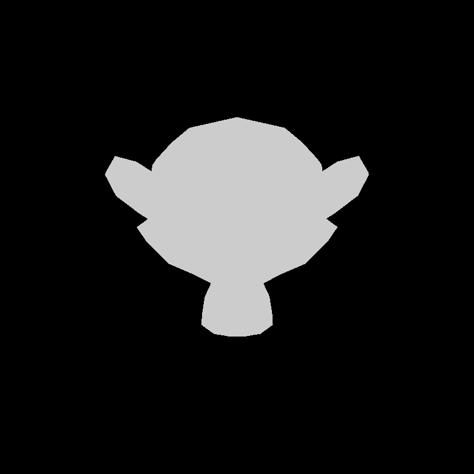
 
 
 ## Debug Level

 For this debug, the vector of nodes is traversed and all elements with the level specified have their respective AABB drawn. A few examples are shown below. The first two show how the difference in the split between level 3 and level 4, and the last image shows the stopping criterion, when splitting is no longer possible.

 

 

 

 ## Debug leaves
 
 For this debug, the vector of nodes is traversed and all the leaf nodes are counted until the one that is asked. It then draws it's AABB and goes through all the triangles and draws them.

 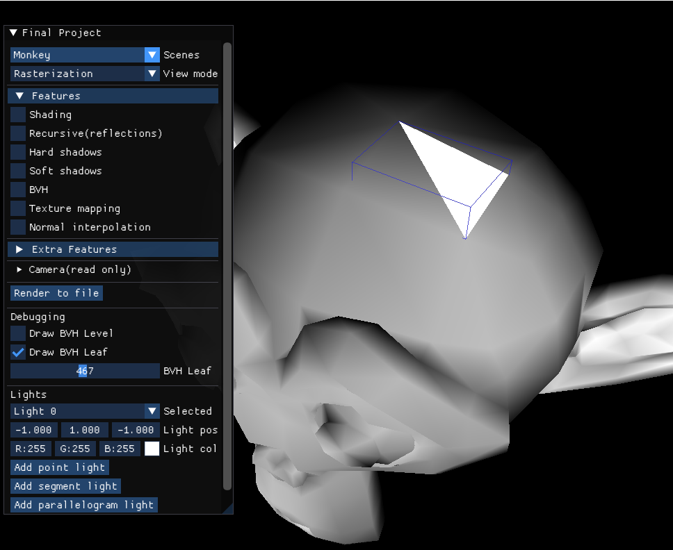

 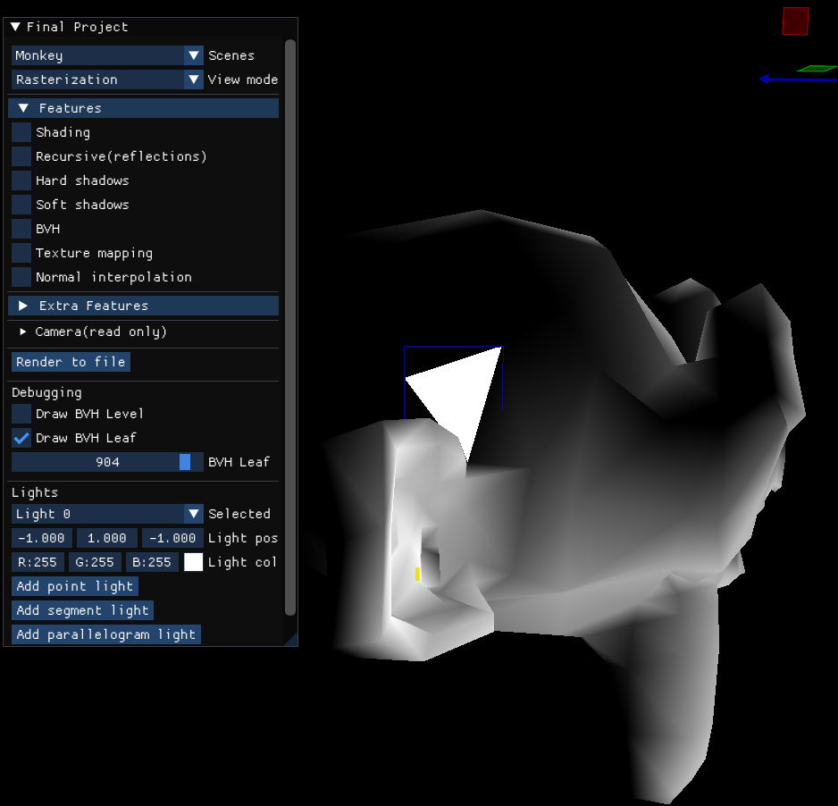

 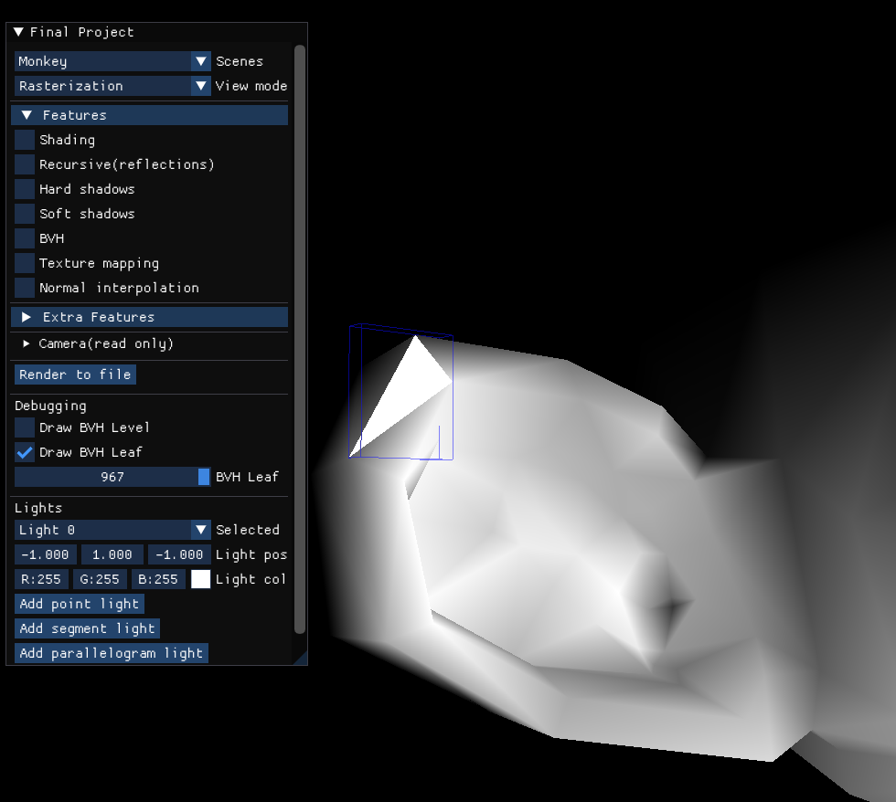

## *Defines* -  Creation Timer

In the `bounding_volume_hierarchy.cpp` file, after the imports, the following code is found:
```cpp
//Timer for creation of BVH
//#define creation_time
```
By uncommenting this `define` the time to create the BVH for the scene is printed.

# 3.5.2 Acceleration data-structure: Traversal

## *Defines*
The traversal has 3 main options from which one can choose. The options are created by using `#ifdef`. They can be switched in code by uncommenting the one that is preferred and commenting the rest. They are found in `bounding_volume_hierarchy.cpp` after the imports, alongside the other `#defines` used throughout this file. Example for using the vector traversal (which is going to be the one that is used, as explained below):
```c++
    // Traversal type
    //#define basic_traversal
    //#define traversal_pq
    #define traversal_vec

    //Timer for traversal for each individual ray
    //#define traversal_debug_time
```
* Note: `traversal_debug_time` can be activated in the same manner. It is used to time how much it takes for a single ray to be drawn.

There are multiple options so that we can choose which one is better suited for the specific use cases. Each option is explained below and there are measurements for how long the render for dragon took. The tests were done on the same laptop in similar circumstances.

## Basic traversal

The `basic_traversal` goes through each node, checking if the AABB is intersected, and if so, checks the children (or the triangles within, if it is a leaf node) until the closest hit is found. 

Time to render dragon: 2020.08 milliseconds

## *Priority Queue* traversal

The `traversal_pq` uses a priority queue that keeps the list always sorted by the distance from the origin of the ray to the node. The *priority_queue* is created using the implementation from `std`. In it, all the nodes that intersect the ray are placed and the closest one is taken for the next check. If it can not find anything closer inside of it, then it disregards it. However, if it does find something that is closer, that node will be placed in the queue and the algorithm will keep running. The *priority_queue* is traversed until it is empty. This is needed because, in case of colliding boxes, there might be a triangle that is the closest hit, but it is placed in the box that is further away (See image below). However, even in the case of no collisions, all the boxes have to be put in the *priority_queue*, because only the furthest box might actally contain a hit. Thus, traversing the whole *priority_queue* is necessary. The optimisation is supposed to come from the ordering and the choice of always picking the closest node. 

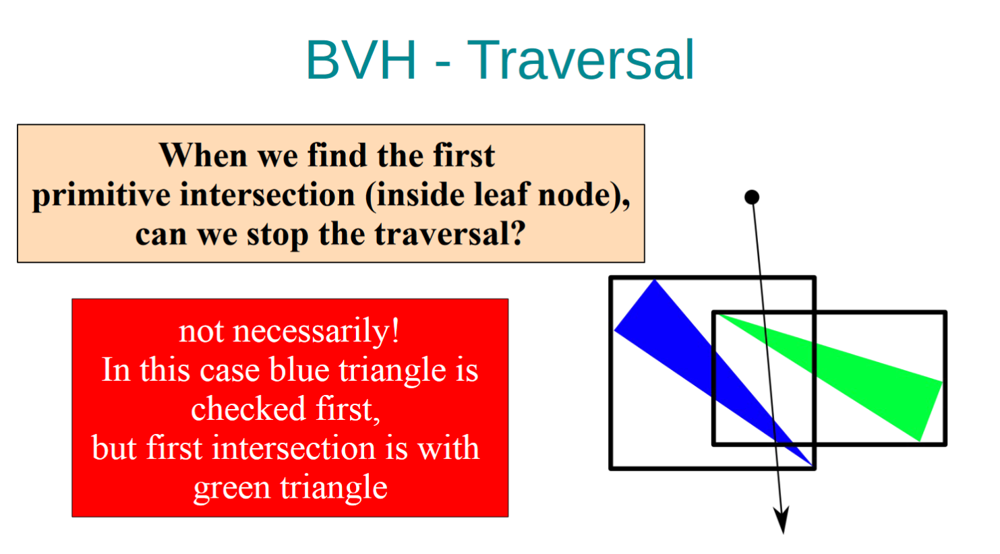

 *Image taken from: [Lecture slides - Accelerated Data structures - slide 137](https://brightspace.tudelft.nl/d2l/le/content/499418/viewContent/2765091/View)*  
 
Time to render dragon: 8216.78 milliseconds

## *Vector* traversal

The `traversal_vec` has the same implementation as for the *priority queue*, but instead uses a vector. For this, there were performed tests on 2 kinds of implementations. As it can be seen below, they perform similarly, but only the *sorted* version has been kept active in the code for the slightly better results. However, the code for *nth_element* can be found commented in the same method.

### *Sorted*

The vector is sorted after the new elements are added, so that the closest element will always be on the last position.

Time to render dragon: 6743.01 milliseconds

### *Nth element* to pick the closest

Before picking the element, we make use of `std::nth_element`, in order to take the maximum element and place it at the end of the vector for O(1) access and removal.

Time to render dragon: 7065.35 milliseconds

As can be seen from the empirical testing done above, the *priority queue* is much slower than the *basic traversal*, even though it should optimize the order of traversed nodes. Thus, the overhead from the creation and maintenance of this data structure is much larger than the possible benefit. The same can be said about the *vector*, performing better than the *priority queue*, but still worse than the naive traversal. Even though they perform slower in the tested case of the dragon, they might outperform the *basic traversal* when the tree is way larger than the 18 levels (counting from level 0) of the dragon and grows towards the maximum limit of 100. However, this is only a hypothesis and it has not yet been tested in any manner. However, because of the assignment, as a default we had to choose one of the 'optimized' implementations. And, because of the better performance, the *sorted* `traversal_vec` has been left as uncommented (i.e active) in the final submission.

## Render Images

These images are similar to the ones shown in *Section 3.5.1*, but they were much faster to produce. These are the times for rendering with and without BVH traversal:

* Monkey
    - With: Time to render image: 2403.82 milliseconds
    - Without: Time to render image: 7331.56 milliseconds
* Teapot
    - With: Time to render image: 2459.72 milliseconds
    - Without: Time to render image: 109022 milliseconds

 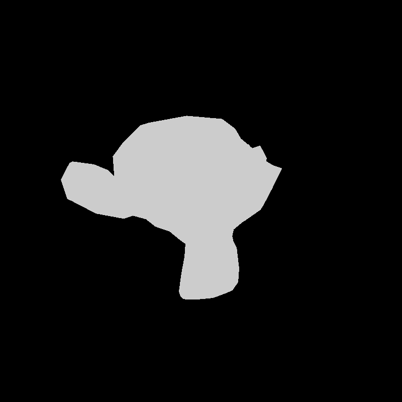
 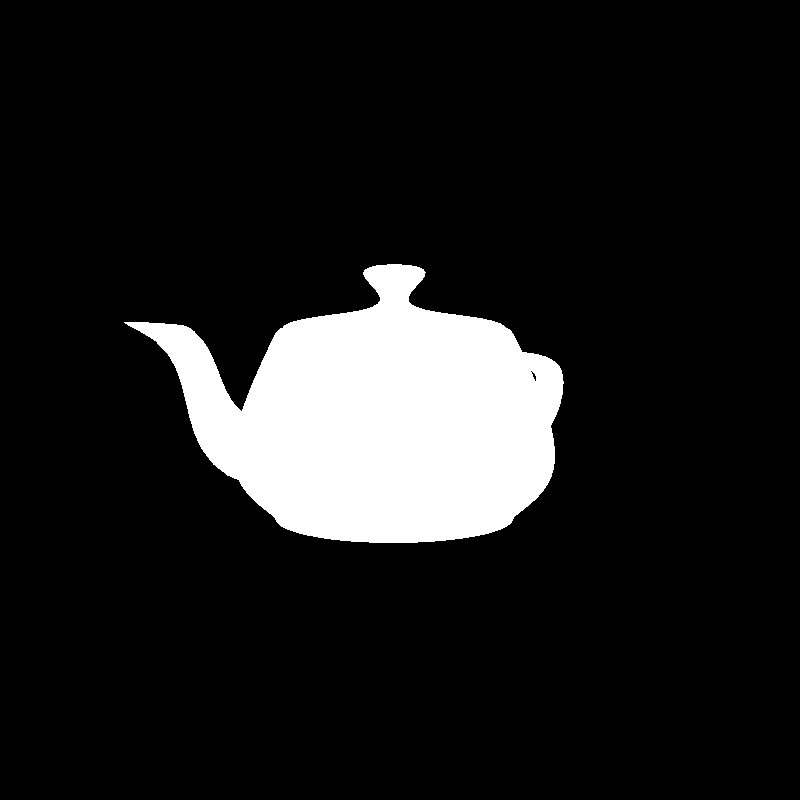

## Visual Debug

The active visual debug, that appears when the `BVH` flag is set, draws with green, for each ray shot, the *aabb* of the *nodes* that the ray intersects.

 
 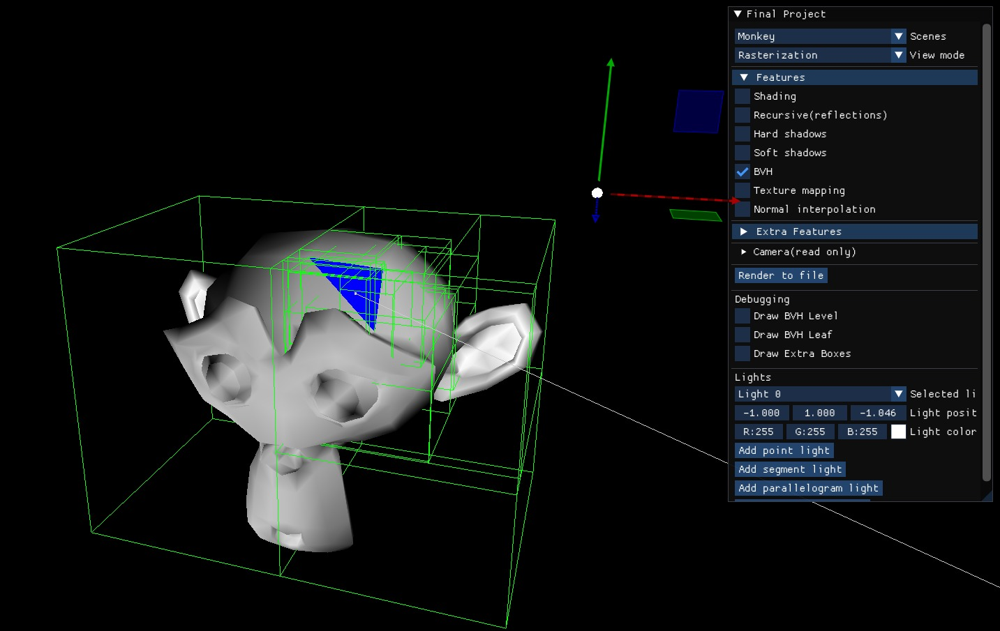

When the `Draw Extra Boxes` flag from the UI is set, the visual debug will now differentiate between checked boxes. The boxes colored green represent the boxes that are checked by the algorithm and intersect the ray, up until it hits a triangle. However, the red boxes represent the boxes that are checked by the algorithm but don't intersect the final ray.

 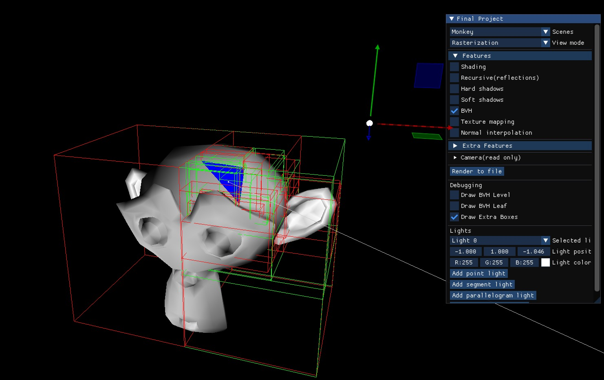

Note that when the ray does not hit anything, only the AABB of the whole scene is drawn as red.

 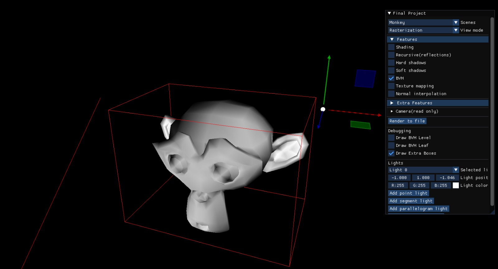

The images below represent the same functionality, with both `Extra Boxes` and without, but for the *Priority_Queue* traversal.

 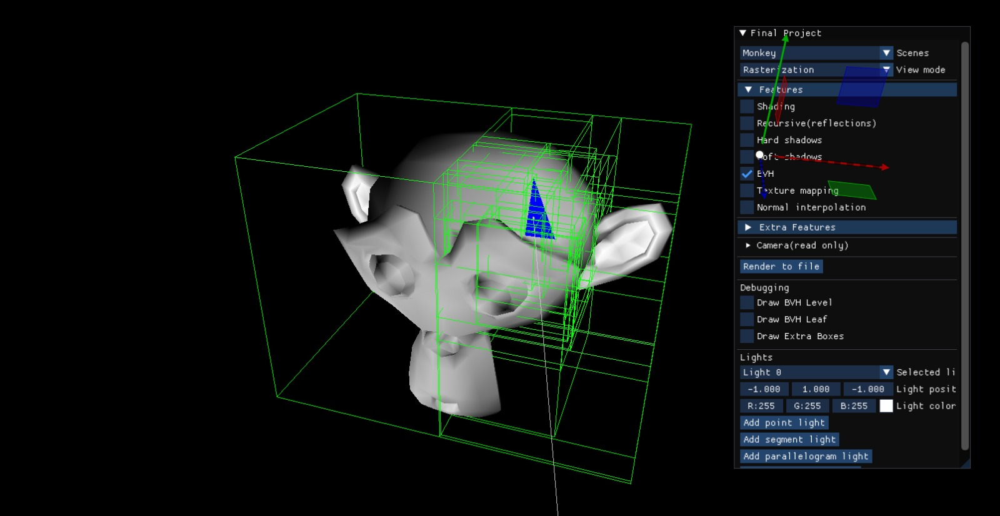
 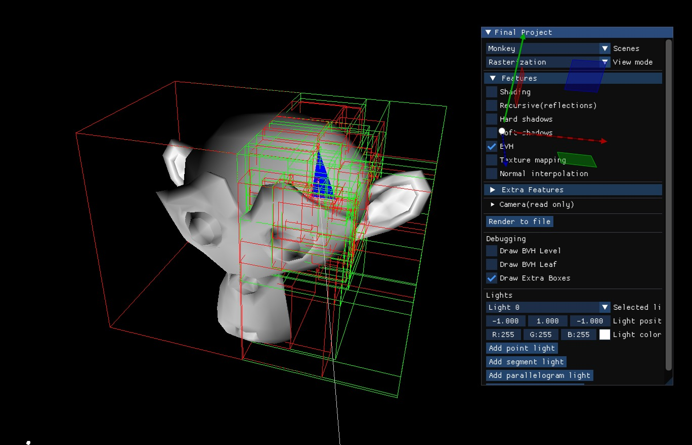

Lastly, the images below are generated from the *Vec* traversal.

 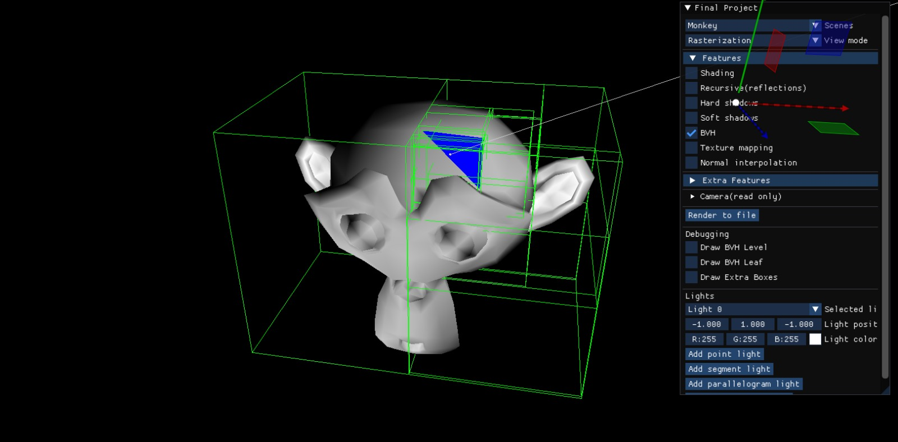
 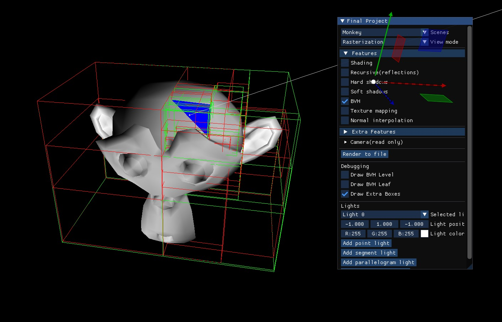

# 3.6 Barycentric coordinates for normal interpolation

Split over 3 methods:

`computeBarycentricCoord(...)` in interpolate.cpp  
`interpolateNormal(...)` in interpolate.cpp  
`intersect` in boundingVolumeHierarcy.cpp

## computeBarycentricCoord 

Calculates the barycentric coordinates dividing the areas of the 3 triangles formed by a
point P inside a triangle ABC with the area of the triangle ABC

## interpolateNormal

Calculates the interpolated normal by multipling each vertex normal with the coresponding barycentric coordinate

## intersect

Here we add the visual debug in 2 ways:
- In rasterization mode: draw the 3 vertice normals and the interpolated normal computed using the vertices from the intersected triangle and the point in which the triangle was intersected.  
- In ray-trace mode: use the interpolated normal instead of the surface normal


### Normal interpolation, Rasterizaton mode, Monkey


### Normal interpolation, Rasterizaton mode, Single triangle


### Normal interpolation, Rasterizaton mode, Single triangle


### NO Normal interpolation, Shading, Ray-trace mode, Monkey


### Normal interpolation, Shading, Ray-trace mode, Monkey

# 3.7 Textures 

`interpolateTexCoords(...)` in interpolate.cpp  
`aquireTexel(...)` in texture.cpp  
`intersect` in boundingVolumeHierarcy.cpp

## interpolateTexCoords

Computes the texture coordinates of a certain point in a triangle by multipling each vertex's texture coord with its respective barycentric coordinate

## aquireTexel

I begin by computing the image's pixel coordinates which is done by multiplying the texture coordinates with the image's width in pixels, and respectively with the height. After finding the pixel coordinates, I retrive and return the pixel color from the image's vector by using the following formula $width \cdot j + i$

## intersect

If textures are enabled, I map the retrived color from the texture to its respective point

Sources used: Lecture 2 - Images and Algebra. (n.d.). Brightspace. https://brightspace.tudelft.nl/d2l/le/content/499418/viewContent/2764991/View


# 4. Extra Features

# 4.2 SAH+binning

## *Defines*
The following code is taken from `bounding_volume_hierarchy.cpp`, and can be found after the rest of the `defines` described in the BVH section. 
* `numBins` represents the number of splits considered by the algorithm.
* `SAHdebug` means that the code will be able to run the visual debug for SAH.
```cpp
//Number of bins used for SAH
#define numBins 5
//Enable Visual Debug for SAH
#define SAHdebug
```

 * Note: another `#define numBins` exists in the `main.cpp` file, below de initializations of the variables used for `debugLevel` and `debugLeaves`. This should be the same in both files, and when a change is wanted, it has to be manually updated in both files.

## SAH split criterion

The difference from the normal BVH is the implementation of a new method (in `bounding_volume_hierarchy.cpp`):
```cpp
void splitBySAH(Scene* pscene,
    BoundingVolumeHierarchy::Node &parent,
    std::vector<int>& left,
    std::vector<int>& right)
```
This new method will be called when the SAH flag is enabled, instead of `splitByMedianTriangle()` (which is used by the previous BVH).

Firstly, the axis with the largest length of the AABB is found. This is done because the axis with the largest span has the most chances to benefit from the split. Then, all centroids are placed in a vector that contains the bin in which the centroid is located, and the pair of indices of mesh and triangle.

When splitting an interval into `numBins` bins (with bins from the interval $[0, numBins - 1]$ ), we need to know the following: `start` of interval and the `length` of the interval (which can also be computed by the *$end - start$* of interval). Then each point in that interval can be mapped into a bin with the following formula: *$(point - low) * numBins / length$*. This formula has been computed by trial and error, by taking multiple examples and trying to map them accordingly. The basic idea is to *translate* the interval to [0, length], by substracting `low` and then *dividing* by the length of a single bin *$length / numBins$* to get the number of bins between 0 and the point. Note that this is stored in an `int`, meaning that for the general case the `floor` of this formula should be used.

Afterwards, the vector is sorted by the bin numbers. Then, each split point is checked if it has the minimum cost, and if so the partition done at that point will be returned to the previous method, to further create the BVH. At each split point the vector is split into `lSplit` which has elements from bins $[0, split]$ and `rSplit` with the elements from bins $[split + 1, numBins - 1]$. Also, the split point at $numBins - 1$ is not taken into consideration, because `lSplit` will have all the elements and no split would be done. The cost for the split is computed by taking the cost of intersecting the primitives (e.g `lSplit.size()`) and multiplying with the probability to hit the new AABB (which is equal to *Volume_split / Volume_parent*) and added together for both left and right and added with the cost of traversal. However, the cost of traversal is constant, so it can be ignored. Also, because the *volume_parent* is present in all probabilities, it can also be disregarded. Thus, the formula used is: `lSplit.size() * volume(AABB(lSplit)) + rSplit.size() * volume(AABB(rSplit))`. To be noted that `cost_min` is initialised with the cost before a split, so if no splitting has a lower cost than splitting, there will be no further divisions done for that node. Also, if the split cost is equal, the split that has the difference bewtween `lSplit.size` and `rSplit.size` minimal is considered (i.e it tries to split the elements in half).
 
## Render Images

 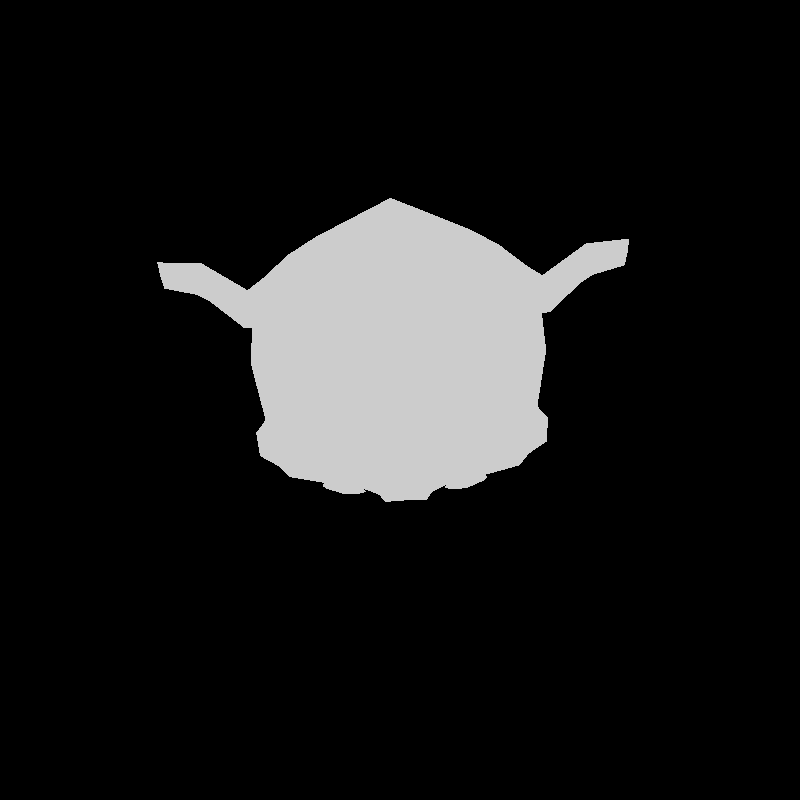
 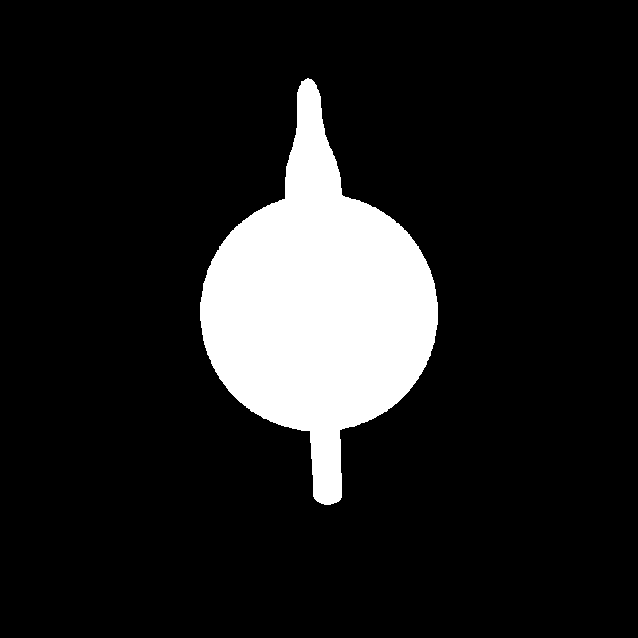

## Visual Debug

In order for the visual debug to work, the method `void debugSAH(int level, int split);` has been added to to the following files:
- `bounding_volume_hierarchy.cpp`
- `bounding_volume_hierarchy.h`
- `bvh_interface.cpp`
- `bvh_interface.h`

The last two files have been modified in order to allow the `debugSAH` method to be called for `bvh` inside of `main.cpp`, because the debug method needs acces to the tree of `Nodes` of bvh. 

Also, in the `Node` struct, the following code has been added:
```cpp
//These are only used for SAH debug puproses
int actual_split = -1;
std::vector<std::pair<int, std::pair<int, int>>> debug_splits;
```
These variables are only updated if `#define SAHdebug` is left uncommented as described above. They are used to store the split with the lowest cost and the vector with bins.

When the SAH flag from extra features is enabled, the UI is updated with a new section called `SAH Debug`, that contains a button `Draw splits`, that will show 2 sliders one for the level of the nodes and one for the split number. The UI is updated from the `main.cpp` file.

The visual debug draws the nodes on the level specified (with a white wireframe) and then draws the boxes that correspond to the chosen split. If the split is the one chosen by the algorithm, the boxes will be drawn green, otherwise they will be red. Note that when no splitting can be done, the red/green boxes will not be drawn. Also, if the `#define SAHdebug` is commented, this debug will behave in a similar way as `debugDrawLevel()`.

The following images show the difference between two splits done at level 0 (level 0 was chosen for visibility purposes)

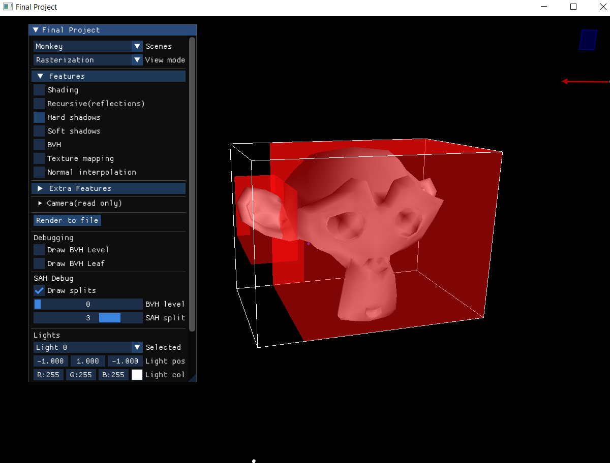
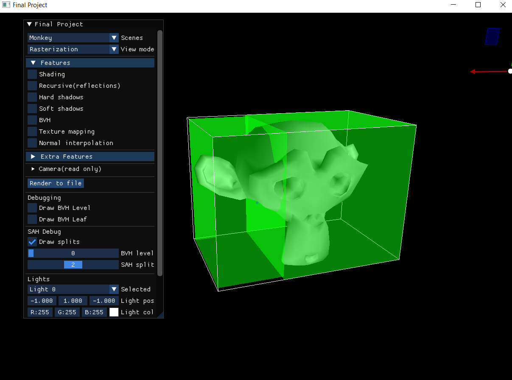

Another interesting outcome is that different splits are green for some nodes, but red for others. For this example, level 2 from monkey has been represented by splits 0,1,2,3.

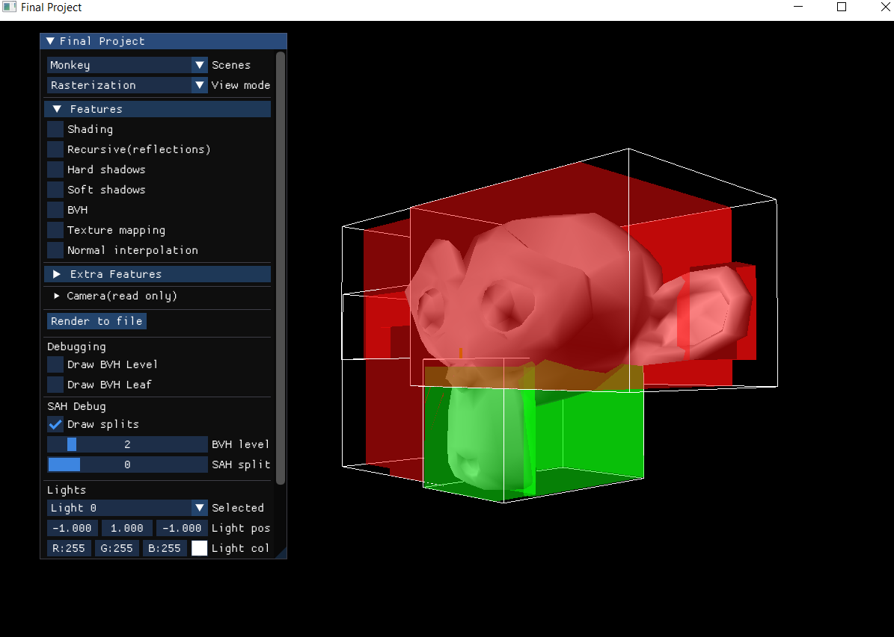
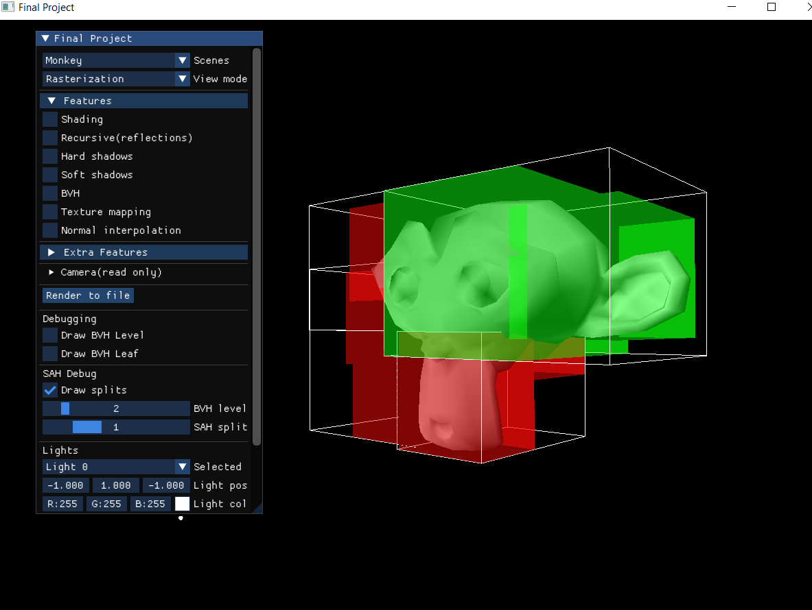
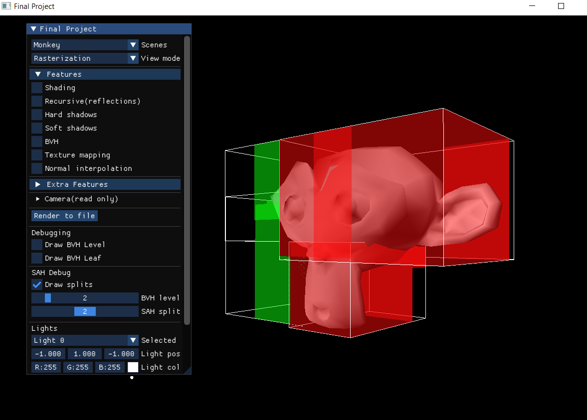
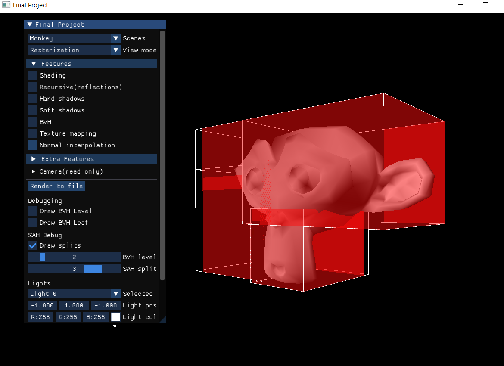

## Other Notes

When the SAH flag is enabled, for the bvh to actually use the new split criterion, the scene needs to be reloaded manually.

# 4.3 Bloom Filter

This part is implemented in the following functions:  
`renderRayTracing` in render.cpp  
`bloomFilter`in render.cpp  
`thresholdScreen`in render.cpp  
`applyBoxFilter`in render.cpp  
`boxFilter`in render.cpp  
`scaleScreen`in render.cpp  
main.cpp
common.h  
render.h

## Main

In main, I added 3 sliders that control the filter size, the scaling factor, and the threshold for the visual debug and 3 buttons(they must be used individually, if more than one is activated, only the higher one in the list will work) that allow you to see each component of the bloom filter(threshold, boxFilter, scaling) individually.

## common.h

I added some flags in order to use the buttons in main.

## render.h

I added some extern variables in order to pass the slider's values to the function.

## renderRayTracing

Passes a reference of the screen to `bloomFIlter` if the bloom effects are enabled

## bloomFilter

Takes the screen and applies 3 steps(treshold, boxFilter, scale) in order to create the bloom filter. Each step is done in a separate function(`thresholdScreen`, `applyBoxFilter`, `scaleScreen`). If any of the 3 visual debug buttons are pressed, the function passes the screen to the respective function and assigns the result to the screen. If none of them are pressed, it adds the bloom filter to the screen's values.

## thresholdScreen

Recevies a `Screen` and goes through its pixels assigning the ones whose average of the RGB components is above the threshold to a black `Screen` . Returns the created `Screen`. 

## applyBoxFilter
Goes through the received `Screen`'s pixels and applies boxFilter to each one of them by using the `boxFilter` function, then it assigns them to a new screen which, in the end, is returned.

## scaleScreen

Goes through the received `Screen`'s pixels and multiplies them with the scaling factor, assigning them to a new screen, which, at the end, is returned.

## Additional info

If none of the buttons are pressed, `bloomFilter` applies the box filter and the scaling on the thresholded screen and then adds it back to the original screen, but if any of the debug buttons is pressed, it will applied the specified function directly to the screen. If more than one button is pressed, the highest one in the list will be displayed.  
Source: Lecture 2 - Images and Algebra. (n.d.). Brightspace. https://brightspace.tudelft.nl/d2l/le/content/499418/viewContent/2764991/View


### !!!The pictures above show the bloom filter with different parameters. The first one has a higher threshold than the 2 bellow. The last 2 pictures have the same threshold but different filter size(the middle one has 1, the last has 7).  
### !!! The pictures bellow show each part of the filter individually(can be accesed using the designated buttons). First one shows only the threshold function applied directly to the screen, the second one shows the box filter applied directly to the screen and the third one shows a low scaling factor applied directly on the screen.


# 4.8 Glossy Reflections

`getFinalColor` in render.cpp
`getGlossyRays` in shading.cpp
`getGlossyRay` in shading.cpp

## getGlossyRay

This function generates a orthonormal basis that defines a square perpendicular to the reflected ray. Afterwards, using a uniform real distribution and the degrees of blur(1/material.shininess) generates 2 coefficients `uCoefficient` and `vCoefficient`. These 2 coefficients are then multiplied with the orthonormal basis and added to the direction of the reflected ray. This operation perturbs the direction of the ray by no more than `a`/2 in each direction. This ray is returned to `getGlossyRays`

## getGlossyRays

This function samples a vector of 500 glossyRays that will be used in `getFinalColor` to average the color of a ray. By averaging the color of the square around the ray, we create the effect of a non-ideal mirror, such as a brushed metal.
  
  Source used: Marschner, S., & Shirley, P. (2016). Fundamentals of Computer Graphics, Fourth Edition. CRC Press. , pages 333-334


### This picture highlights how a vector of 500 rays averges the color of a square of width `a`(degrees of blur)


### This picture shows how a glossy surface is rendered using ray trace mode.
 
# 4.9 Transparency

`getFinalColor` in render.cpp
! Needs recursive ray tracer in order to work.  
If transparency is enabled, it will check if the surface is transparent and that the ray hasn't reached its maximum depth. If the conditions are met, it will shoot a ray through the transparent panel and it will calculate its color using alpha blending. When the ray is extended, the origin of the extension is displaced by a factor of epsilon(a really small factor) in its direction, in order to avoid auto intersection.


### In this 2 pictures, the same ray can be seen from outside the cube(first picture) and from inside the cube(second picture). The ray that enters the triangle has slightly lighter color than the one inside(better seen if looking at the 2 dots in the second picture) because it alpha blends both cube faces that it passes and the background, while the one inside only alpha blends the green face with the background. The ray that exists is red beacuse it does not intersect any surface and therfore it has an infinite length.


### This last picture shows a transparent cube in ray trace mode, highlighting the alpha blending between the faces.t

# 4.10 Deapth Of Field

## *Defines* and initialisations
There are 2 places where new `#defines` have been declared for this feature. The first one is located in `render.cpp` and can be found above the methods for `renderRayTracing()`, `executeDepthOfField()` and `randomOffset()`: `#define numSamples 20`. This represents the number of secundary rays generated by by the `executeDepthOfField()` method, for each ray given. The higher the `numSamples` the better the result will be. However, it is set to a relatively low number to limit performance issues during testing. The second place is in `main.cpp` file, at the very beginning of the `main()` method:
```cpp
    // Deapth of Field variables
    #define MAX_FOCAL_LENGTH 30.0f
    #define MIN_FOCAL_LENGTH 0.1f
    #define MAX_APERTURE 1.0f
    #define MIN_APERTURE 0.1f

    bool dof = { false };

    //This enables the visual debug for deapth of field
    #define DOFdebug
```
The `#defines` and variables are used for the sliders in the UI, so that the user can change the `focal_length` and the `aperture` bewteen the `MIN_APERTURE`, `MAX_APERTURE`, and `MIN_FOCAL_LENGTH`, `MAX_FOCAL_LENGTH`, respectively. These 2 variables can be found in the `Features` struct from `common.h`, inside the `DOF` sturct. They have been placed here for easier access for the method that computes the depth of field, that is located inside `render.cpp`. 

## Calculating the Depth Of Field

The acutal implementation of depth of field can be located in `executeDepthOfField()`, which is in `render.cpp` file, above the `renderRayTracing()` method. Firstly, it calculates the `focal_point` that lies on the ray that it receives at distance `focal_length`. Then, it generates `numSamples` secondary rays that have the same origin as the primary ray, but shifted by a *random offset* in all direction. The direction for the secondary rays is given by their origins and the `focal_point`. The final color is given by averaging the colors from all these rays.

## Random Offset

The random offset gives a random float number between $-aperture$ and $+aperture$. This is done by generating a random float number using the C++ `rand()` function and dividing it by `RAND_MAX`, so that this value is between 0 and 1. Then, it is multiplied by $2 * aperture$, so that the value is between 0 and $2 * aperture$. Finally, the values are shifted by subtracting $-aperture$, so that the values now lie in the desired interval. 

## Render Images

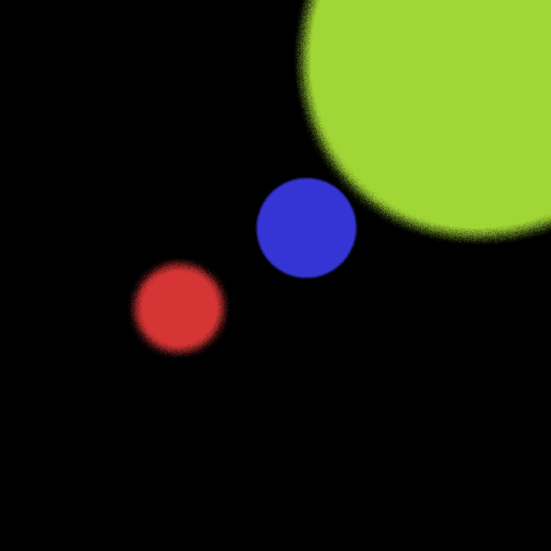


Both images are taken with a similar aperture, but different `focal_length`. For the first picture, the `focal_length` was chosen in such a way that the blue (middle - second closest) sphere was in focused, while the second picture depicts the lime (right - closest) sphere in focus and the others out of focus.

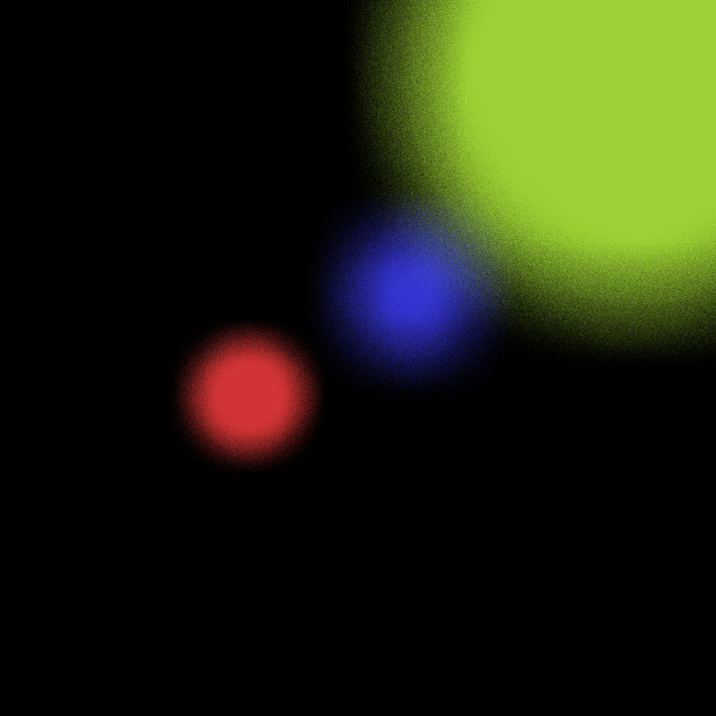

This last image, was taken with an increased number of samples and `focal_length` set to the maximum predefined value, in order to exagerate the effects of depth of field for all objects.

## Visual Debug

As mentioned above, for the visual debug to work, the `#define DOFdebug` has to be left uncommented. The visual debug draws the wireframe of the sphere (a new method has been implented in `draw.cpp` for this purpose called `drawSphereWireFrame()`). This sphere is centered around the camera and has the radius `focal_length`, meaning that all objects that are intersected by this sphere have the part that is intersected in focus. Also, the sphere moves along with the camera. This visual debug is only active in *Rasterization*, so that the effects that would happen in *Ray Traced* can be *previewed*, without performance issues.

For example the image below will correspond to the first image that has been shown above, where the middle sphere is in focus and the rest are not.

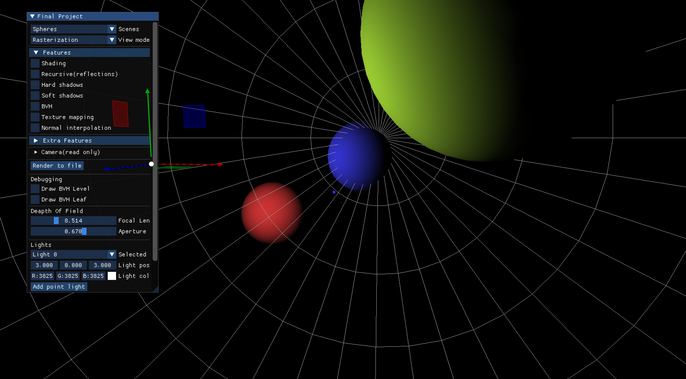

When the `focal_length` is not big enough for the *focal sphere* to reach any object, than all the wireframes of the sphere will appear in front of the objects, meanwhile, if it's too big, all object will be in front of the wireframe.

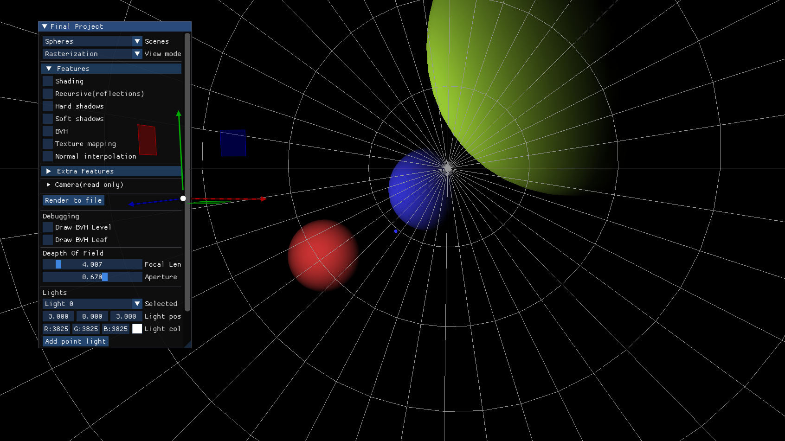
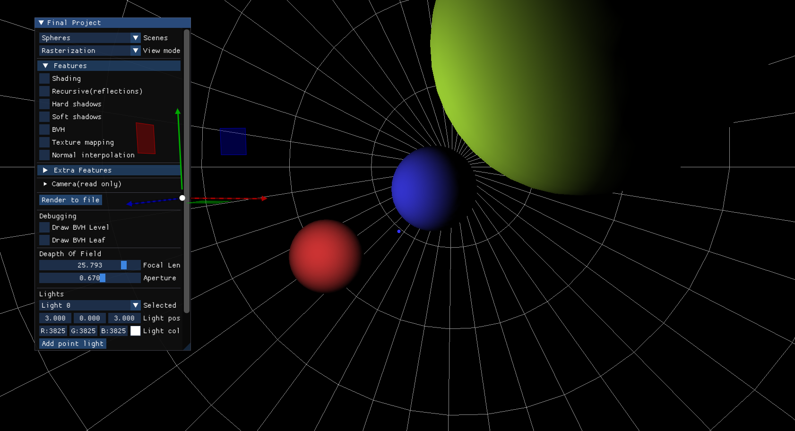

# 6.4 Performance Test

The following table has been filled with the times for creating and rendering with different scenes and algorithms.

|                                      | Cornell Box |   Monkey   |   Dragon   |
| :----------------------------------- | :---------: | :--------: | :--------: |
| Num Triangles                        |     32      |    968     |    87K     |
| Time to create                       |  0.1073 ms  |  1.581 ms  | 166.793 ms |
| Time to create with SAH              |  0.0991 ms  | 2.6324 ms  | 345.769 ms |
| Time to render for basic             | 1064.87 ms  | 1665.16 ms | 2020.08 ms |
| Time to render for PQ                | 1985.43 ms  | 2949.06 ms | 8216.78 ms |
| Time to render for Vec (Nth element) | 2923.67 ms  | 4290.63 ms | 7065.35 ms |
| Time to render for Vec  (Sort)       | 2717.67 ms  | 3403.93 ms | 6743.01 ms |
| Time to render with SAH  for basic   | 1034.82 ms  | 1210.08 ms | 1580.00 ms |
| BVH levels                           |      6      |     11     |     17     |
| BVH with SAH levels                  |      9      |     17     |     24     |
| Max tris p/ leaf node                |      1      |     1      |     1      |
| Max tris p/ leaf node (SAH)          |     10      |     21     |     17     |

Note: For rendering with SAH the `#define SAHdebug` is commented. 
